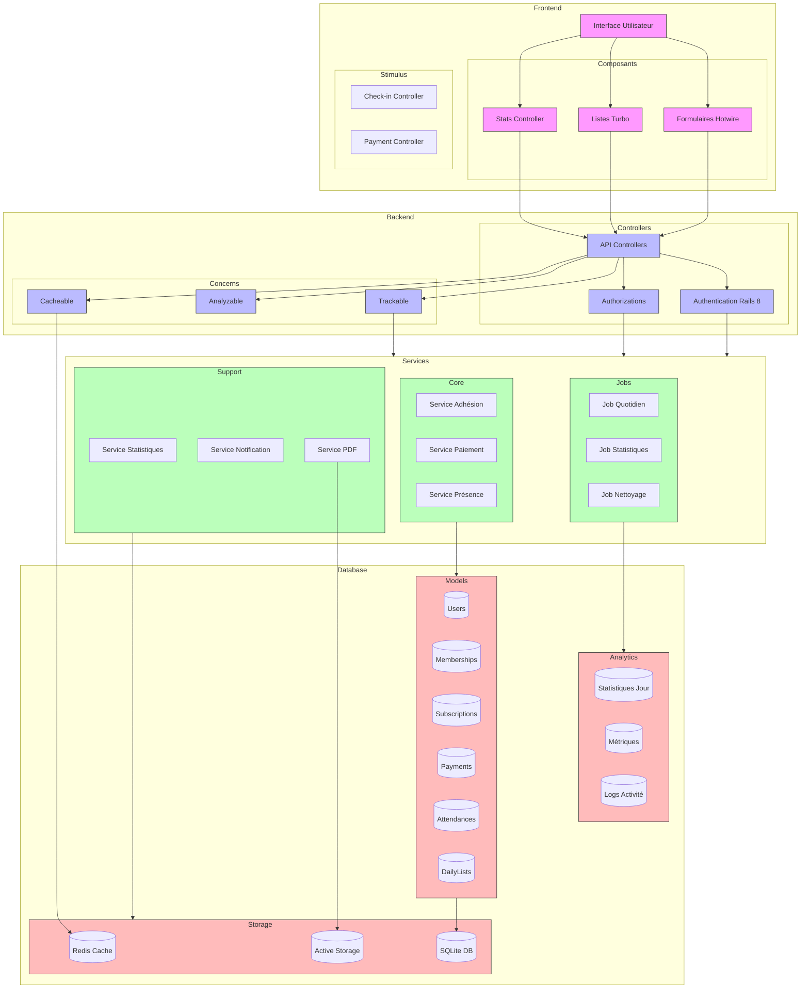

```mermaid
graph TB
    %% Interface Utilisateur
    subgraph Frontend
        UI[Interface Utilisateur]
        subgraph Composants
            Forms[Formulaires Hotwire]
            Lists[Listes Turbo]
            Stats[Tableaux de Bord]
        end
        subgraph Stimulus
            CheckIn[Check-in Controller]
            Payment[Payment Controller]
            Stats[Stats Controller]
        end
    end

    %% Backend
    subgraph Backend
        subgraph Controllers
            API[API Controllers]
            Auth[Authentication Rails 8]
            Perm[Authorizations]
        end
        
        subgraph Concerns
            Track[Trackable]
            Analyze[Analyzable]
            Cache[Cacheable]
        end
    end

    %% Services Métier
    subgraph Services
        subgraph Core
            MembershipService[Service Adhésion]
            PaymentService[Service Paiement]
            AttendanceService[Service Présence]
        end
        
        subgraph Support
            StatsService[Service Statistiques]
            NotificationService[Service Notification]
            PDFService[Service PDF]
        end
        
        subgraph Jobs
            DailyJob[Job Quotidien]
            StatsJob[Job Statistiques]
            CleanupJob[Job Nettoyage]
        end
    end

    %% Base de Données
    subgraph Database
        subgraph Models
            Users[(Users)]
            Memberships[(Memberships)]
            Subscriptions[(Subscriptions)]
            Payments[(Payments)]
            Attendances[(Attendances)]
            DailyLists[(DailyLists)]
        end
        
        subgraph Storage
            Redis[(Redis Cache)]
            SQLite[(SQLite DB)]
            Assets[(Active Storage)]
        end
        
        subgraph Analytics
            DailyStats[(Statistiques Jour)]
            Metrics[(Métriques)]
            Logs[(Logs Activité)]
        end
    end

    %% Relations
    UI --> Forms
    UI --> Lists
    UI --> Stats
    Forms --> API
    Lists --> API
    Stats --> API
    
    API --> Auth
    API --> Perm
    API --> Track
    API --> Analyze
    API --> Cache
    
    Auth --> Services
    Perm --> Services
    Track --> Services
    
    Core --> Models
    Support --> Storage
    Jobs --> Analytics
    
    Models --> SQLite
    Cache --> Redis
    PDFService --> Assets

    %% Styles
    classDef frontend fill:#f9f,stroke:#333
    classDef backend fill:#bbf,stroke:#333
    classDef service fill:#bfb,stroke:#333
    classDef storage fill:#fbb,stroke:#333
    
    class UI,Forms,Lists,Stats frontend
    class API,Auth,Perm,Track,Analyze,Cache backend
    class Core,Support,Jobs service
    class Models,Storage,Analytics storage
``` 