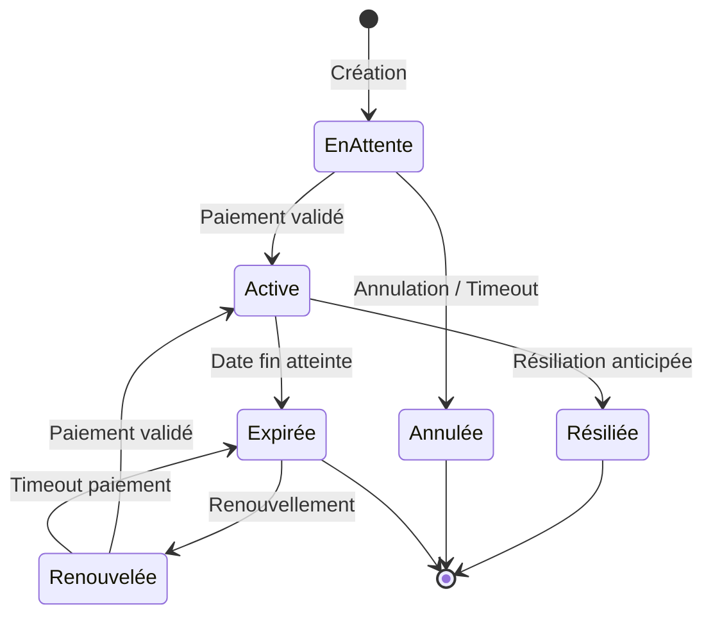

# Diagramme d'États des Adhésions

Ce diagramme présente les différents états possibles d'une adhésion au Circographe et les transitions entre ces états.

## Diagramme

## Description des États

| État | Description | Actions Possibles |
|------|-------------|-------------------|
| **EnAttente** | Adhésion créée mais paiement non finalisé | Payer, Annuler |
| **Active** | Adhésion en cours de validité | Résilier, Consulter carte membre |
| **Expirée** | Adhésion dont la date de fin est dépassée | Renouveler |
| **Renouvelée** | Adhésion en attente de paiement pour renouvellement | Payer, Annuler renouvellement |
| **Résiliée** | Adhésion terminée avant sa date de fin | Créer nouvelle adhésion |
| **Annulée** | Adhésion annulée avant activation | Créer nouvelle adhésion |

## Règles de Transition

1. **Création → EnAttente**
   - Déclencheur: Utilisateur complète formulaire d'adhésion
   - Conditions: Informations valides
   - Actions système: Génération facture, notification

2. **EnAttente → Active**
   - Déclencheur: Paiement reçu et validé
   - Conditions: Paiement dans les 7 jours après création
   - Actions système: Génération carte membre, notification, mise à jour comptable

3. **EnAttente → Annulée**
   - Déclencheur: Utilisateur annule OU 7 jours sans paiement
   - Conditions: Aucune
   - Actions système: Notification, suppression facture

4. **Active → Expirée**
   - Déclencheur: Date de fin atteinte
   - Conditions: Aucune
   - Actions système: Notification, rappel renouvellement

5. **Active → Résiliée**
   - Déclencheur: Demande de résiliation par membre ou admin
   - Conditions: Motif valide
   - Actions système: Notification, mise à jour comptable

6. **Expirée → Renouvelée**
   - Déclencheur: Utilisateur demande renouvellement
   - Conditions: Moins de 30 jours après expiration
   - Actions système: Génération facture, notification

## Intégration avec d'autres Domaines

- **Paiement**: Transitions EnAttente → Active et Renouvelée → Active
- **Notification**: Toutes les transitions génèrent des notifications
- **Présence**: État Active requis pour accès aux entraînements (avec cotisation valide)
- **Rôles**: L'état de l'adhésion affecte les permissions disponibles

---

*Version: 1.0 - Dernière mise à jour: Février 2024*
