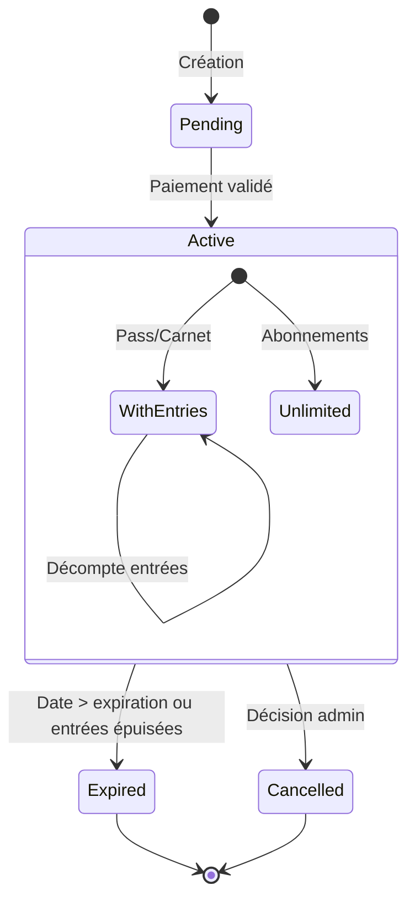

# Diagramme des États d'une Cotisation

Ce diagramme représente les différents états possibles d'une cotisation au Circographe et les transitions entre ces états.

## Légende

- **Pending**: Cotisation créée mais en attente de paiement
- **Active**: Cotisation valide et utilisable
  - **WithEntries**: Cotisation avec compteur d'entrées (Pass Journée, Carnet)
  - **Unlimited**: Cotisation à durée déterminée sans compteur (Abonnements)
- **Expired**: Cotisation expirée (fin de validité ou entrées épuisées)
- **Cancelled**: Cotisation annulée par un administrateur

## Transitions clés

1. Création → Pending
2. Paiement validé → Active
3. Active (fin validité ou entrées épuisées) → Expired
4. Active (décision admin) → Cancelled
5. Dans l'état WithEntries : décompte des entrées à chaque utilisation 