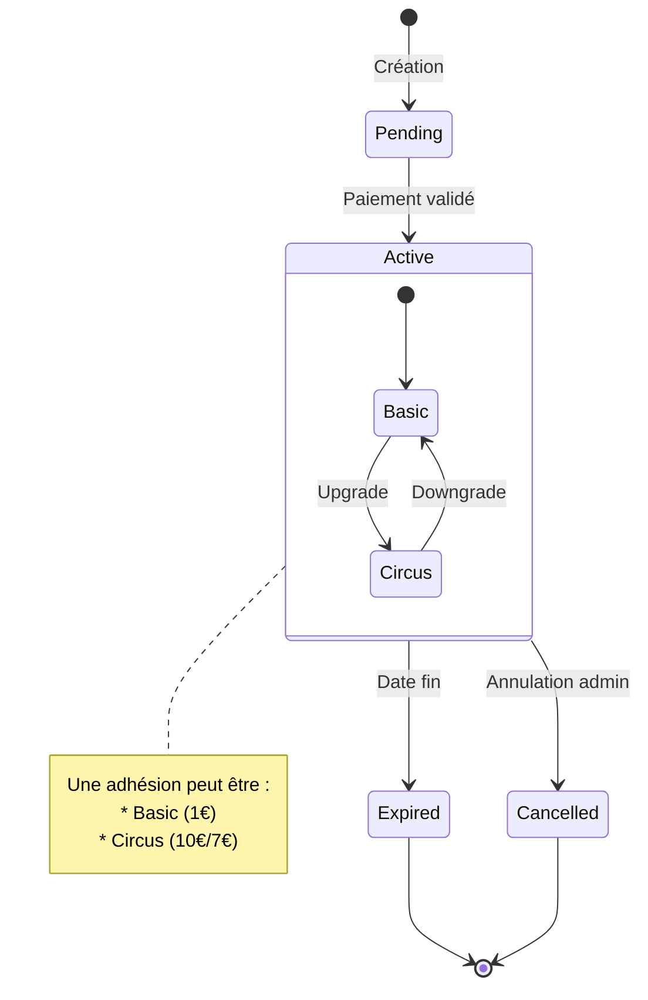

# États des Adhésions

```mermaid
stateDiagram-v2
    [*] --> Pending: Création
    Pending --> Active: Paiement validé
    Active --> Expired: Date fin
    Active --> Cancelled: Annulation admin
    
    state Active {
        [*] --> Basic
        Basic --> Circus: Upgrade
        Circus --> Basic: Downgrade
    }
    
    Expired --> [*]
    Cancelled --> [*]

    note right of Active
        Une adhésion peut être :
        * Basic (1€)
        * Circus (10€/7€)
    end note
``` 