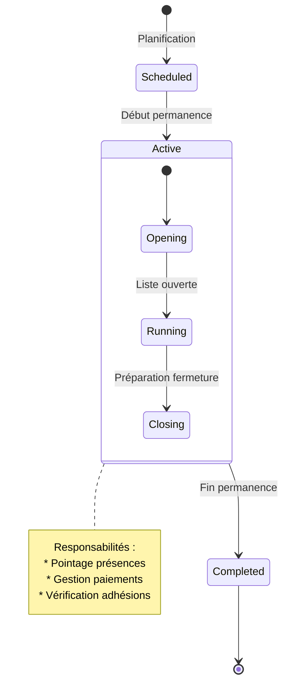

# États des Permanences Bénévoles

```mermaid
stateDiagram-v2
    [*] --> Scheduled: Planification
    Scheduled --> Active: Début permanence
    Active --> Completed: Fin permanence
    
    state Active {
        [*] --> Opening
        Opening --> Running: Liste ouverte
        Running --> Closing: Préparation fermeture
    }
    
    Completed --> [*]

    note right of Active
        Responsabilités :
        * Pointage présences
        * Gestion paiements
        * Vérification adhésions
    end note
``` 