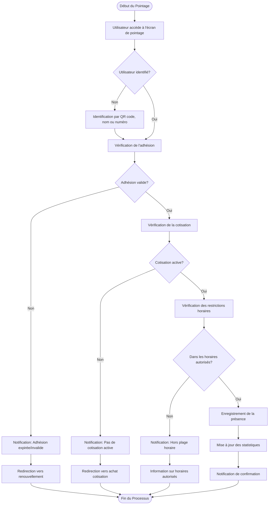

# Diagramme de Flux - Processus de Pointage

## Vue d'ensemble

Ce document décrit le flux de processus pour l'enregistrement des présences (check-in) dans le système du Circographe, incluant les différentes étapes et les règles de validation appliquées.

## Diagramme de Flux

## Description des Étapes

1. **Début du Pointage**: Initiation du processus de pointage (par le bénévole à l'accueil)
2. **Identification**: Reconnaissance de l'utilisateur par divers moyens (QR code, recherche par nom, etc.)
3. **Vérification de l'Adhésion**: Contrôle de la validité de l'adhésion (expiration, statut)
4. **Vérification de la Cotisation**: Contrôle de l'existence d'une cotisation active
5. **Vérification des Restrictions Horaires**: Contrôle de la compatibilité avec la formule de cotisation
6. **Enregistrement**: Création de l'enregistrement de présence dans le système
7. **Mise à jour des Statistiques**: Actualisation des compteurs et statistiques liés aux présences
8. **Confirmation**: Notification visuelle et/ou sonore de confirmation du pointage

## Règles et Conditions

- Un utilisateur doit avoir une adhésion valide (non expirée, statut "actif")
- Un utilisateur doit avoir une cotisation active pour accéder aux entraînements
- Certaines formules de cotisation ont des restrictions horaires (jours, heures)
- Le système doit enregistrer l'horodatage précis de chaque pointage
- Les statistiques de présence doivent être mises à jour en temps réel

## Références

- [Règles du Domaine Présence](../../../requirements/1_métier/presence/regles.md)
- [Spécifications Techniques - Présence](../../../requirements/1_métier/presence/specs.md)
- [Matrice des Formules de Cotisation](../matrices/subscription_matrix.md)

---

*Dernière mise à jour: Mars 2023*
