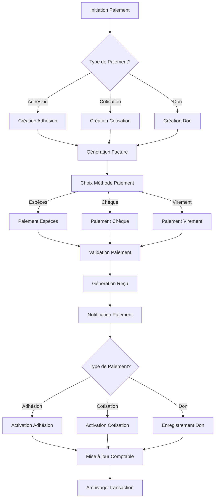

# Flux de Paiement

Ce diagramme présente le processus complet de paiement dans l'application Le Circographe, depuis l'initiation jusqu'à la finalisation et la génération des reçus.

## Diagramme

## Description des Étapes

### 1. Initiation du Paiement
- **Acteur**: Membre ou Administrateur
- **Description**: Début du processus de paiement
- **Entrées**: Identité du payeur, montant, objet du paiement

### 2. Type de Paiement
- **Description**: Détermination du type de paiement (adhésion, cotisation, don)
- **Règles**: Différentes règles de validation selon le type

### 3. Création de l'Objet Associé
- **Description**: Création de l'enregistrement correspondant au type de paiement
- **Actions système**: Génération d'un identifiant unique, enregistrement des détails

### 4. Génération de Facture
- **Description**: Création d'un document de facturation
- **Contenu**: Informations légales, détails du paiement, conditions

### 5. Choix de la Méthode de Paiement
- **Acteur**: Membre ou Administrateur
- **Options**: Espèces, chèque, virement bancaire
- **Règles**: Certaines méthodes peuvent être restreintes selon le montant

### 6. Traitement du Paiement
- **Description**: Processus spécifique à chaque méthode de paiement
- **Validation**: Vérification des informations et confirmation

### 7. Validation du Paiement
- **Acteur**: Administrateur (ou automatique pour certains paiements)
- **Actions**: Confirmation de la réception des fonds
- **Statut**: Passage du statut "En attente" à "Validé"

### 8. Génération du Reçu
- **Description**: Création d'un document officiel confirmant le paiement
- **Contenu**: Informations légales, détails du paiement, numéro unique

### 9. Notification
- **Description**: Envoi d'une confirmation au membre
- **Canaux**: Email, notification in-app
- **Contenu**: Confirmation, reçu en pièce jointe, instructions supplémentaires

### 10. Activation de l'Objet Associé
- **Description**: Mise à jour du statut de l'adhésion, cotisation ou don
- **Actions système**: Modification des permissions, mise à jour des dates de validité

### 11. Mise à jour Comptable
- **Description**: Enregistrement de la transaction dans le système comptable
- **Actions**: Mise à jour des soldes, catégorisation comptable

### 12. Archivage
- **Description**: Finalisation et archivage de la transaction
- **Actions**: Stockage sécurisé des documents, indexation pour recherche future

## Intégration avec d'autres Domaines

- **Adhésion**: Le flux active une nouvelle adhésion ou un renouvellement
- **Cotisation**: Le flux active une nouvelle cotisation ou prolonge une existante
- **Notification**: Des notifications sont envoyées à plusieurs étapes du processus
- **Présence**: L'activation d'une cotisation peut modifier les droits d'accès

## Gestion des Erreurs

| Étape | Erreur Possible | Action de Récupération |
|-------|-----------------|------------------------|
| Validation Paiement | Fonds insuffisants | Notification au membre, mise en attente |
| Choix Méthode | Méthode non disponible | Proposition alternatives, aide admin |
| Génération Reçu | Erreur système | Génération manuelle, notification admin |

---

*Version: 1.0 - Dernière mise à jour: Février 2024*
