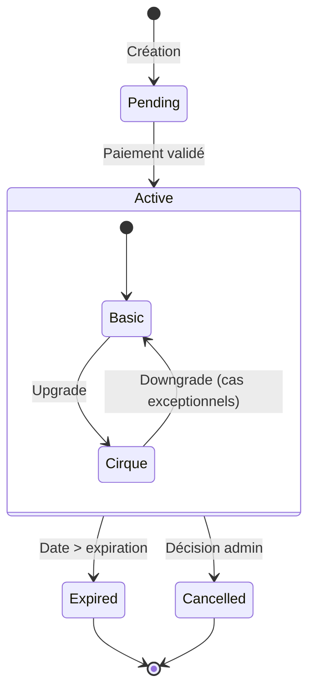

# Diagramme des États d'Adhésion

Ce diagramme représente les différents états possibles d'une adhésion au Circographe et les transitions entre ces états.

## Légende

- **Pending**: Adhésion créée mais en attente de paiement
- **Active**: Adhésion valide et utilisable
  - **Basic**: Adhésion basique (1€)
  - **Cirque**: Adhésion complète (10€/7€)
- **Expired**: Adhésion expirée (fin de validité)
- **Cancelled**: Adhésion annulée par un administrateur

## Transitions clés

1. Création → Pending
2. Paiement validé → Active
3. Active (fin validité) → Expired
4. Active (décision admin) → Cancelled
5. Basic → Cirque (upgrade)
6. Cirque → Basic (downgrade - cas exceptionnels) 