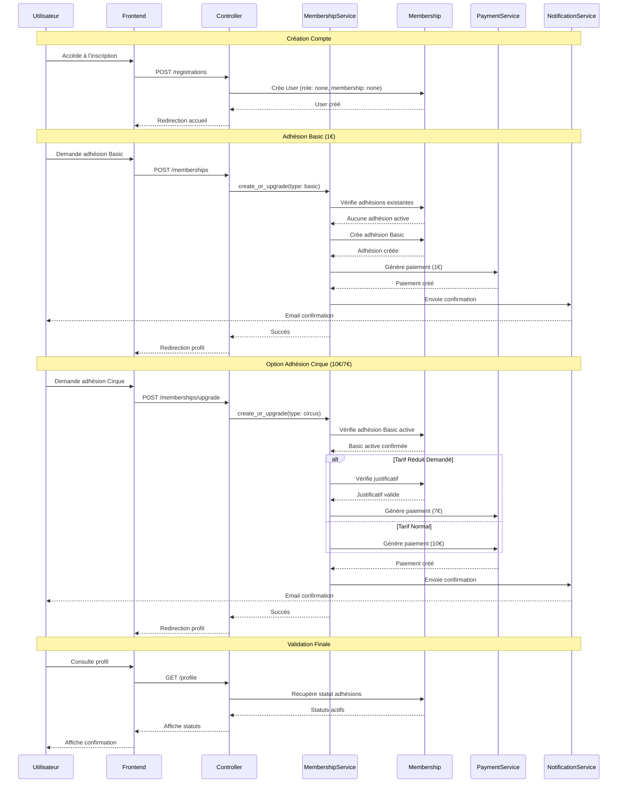

# Processus d'Adhésion 👥

## Diagramme du Processus

## États et Transitions

### Types d'Adhésion
- **None** (0) : Compte créé sans adhésion
- **Basic** (1) : Adhésion basique (1€/an)
- **Circus** (2) : Adhésion cirque (10€/7€ avec tarif réduit)

### Conditions
1. **Adhésion Basic**
   - Requiert un compte vérifié
   - Paiement de 1€
   - Validité 1 an

2. **Adhésion Cirque**
   - Requiert une adhésion Basic active
   - Paiement de 10€ (ou 7€ avec justificatif)
   - Validité 1 an
   - Justificatif pour tarif réduit

### Tarifs Réduits
- **Conditions** : Étudiant, Chômeur, RSA, Mineur
- **Réduction** : 30% sur adhésion Cirque
- **Justificatif** obligatoire
- **Validation** par admin requise

## Validations

### Règles Métier
1. Une seule adhésion active par type
2. Adhésion Basic requise pour Cirque
3. Pas de chevauchement de dates
4. Renouvellement possible 30 jours avant expiration

### Vérifications Système
1. Unicité email/membre
2. Validité des dates
3. Justificatifs tarif réduit
4. Cohérence des paiements 