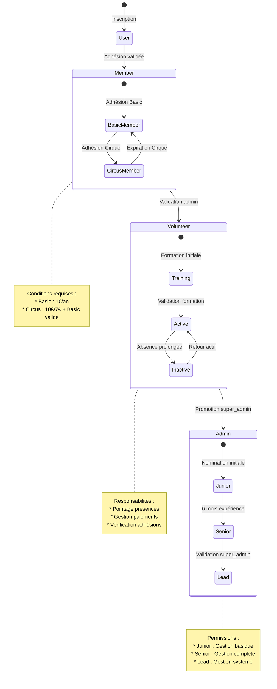

# États et Transitions des Rôles

```mermaid
stateDiagram-v2
    [*] --> User: Inscription
    User --> Member: Adhésion validée
    Member --> Volunteer: Validation admin
    Volunteer --> Admin: Promotion super_admin
    
    state Member {
        [*] --> BasicMember: Adhésion Basic
        BasicMember --> CircusMember: Adhésion Cirque
        CircusMember --> BasicMember: Expiration Cirque
    }
    
    state Volunteer {
        [*] --> Training: Formation initiale
        Training --> Active: Validation formation
        Active --> Inactive: Absence prolongée
        Inactive --> Active: Retour actif
    }
    
    state Admin {
        [*] --> Junior: Nomination initiale
        Junior --> Senior: 6 mois expérience
        Senior --> Lead: Validation super_admin
    }

    note right of Member
        Conditions requises :
        * Basic : 1€/an
        * Circus : 10€/7€ + Basic valide
    end note

    note right of Volunteer
        Responsabilités :
        * Pointage présences
        * Gestion paiements
        * Vérification adhésions
    end note

    note right of Admin
        Permissions :
        * Junior : Gestion basique
        * Senior : Gestion complète
        * Lead : Gestion système
    end note
``` 