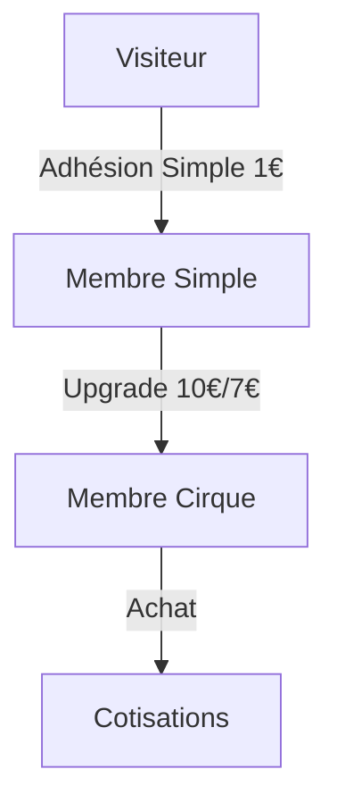
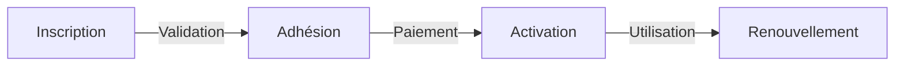
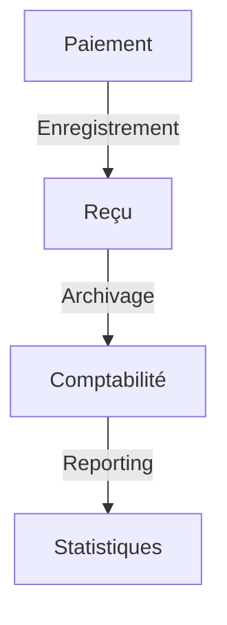

# Logique Métier - Le Circographe

## Vue d'ensemble
L'application gère une association de cirque avec différents niveaux d'adhésion et un système de gestion des entraînements.

## Composants Principaux

### 1. Utilisateurs et Rôles
Backend :
- Utilisateur : compte sans adhésion
- Membre : statut de base pour tout adhérent
- Bénévole : membre avec accès admin basique
- Admin : accès complet
- Super Admin : accès total (godmode)

Frontend :
- Utilisateur : compte sans adhésion
- Adhérent : membre avec adhésion Basic
- Adhérent Cirque : membre avec adhésion Circus
- Bénévole : accès admin basique
- Admin : accès complet
- Super Admin : accès total

### 2. Types d'Adhésion
- Basic (1€) : accès aux événements
- Circus :
  * Prix normal : 10€
  * Prix réduit : 7€ (avec justificatif)
  * Upgrade depuis Basic : 9€ ou 6€ (réduit)
- Durée : 1 an
- Souscription uniquement sur place

### 3. Gestion des Entraînements
- Pointage par les bénévoles
- Pas d'inscription en ligne
- Accès réservé aux membres Circus

### 4. Système de Paiement
- Paiement sur place uniquement
- Système de donations
- Traçabilité complète

## Organisation de la Documentation
- [`adhesions.md`](./adhesions.md) : Système complet d'adhésion et rôles

## Principes Fondamentaux
1. Simplicité administrative
   - Adhésions gérées sur place
   - Processus simples et directs

2. Contrôle d'accès
   - Adhésion requise pour participer
   - Rôles clairement définis
   - Permissions progressives

3. Traçabilité
   - Historique des adhésions
   - Suivi des paiements
   - Journal des présences

## Processus Clés

### 1. Gestion des Adhésions

### 2. Cycle de Vie Membre

### 3. Flux Financier

## Points d'Attention
- Vérification des droits en temps réel
- Gestion des cas particuliers
- Traçabilité des modifications
- Support multi-rôles 