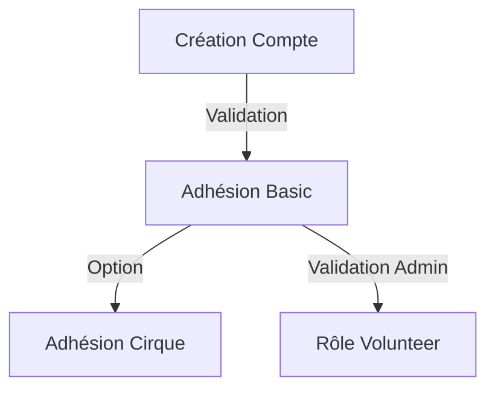
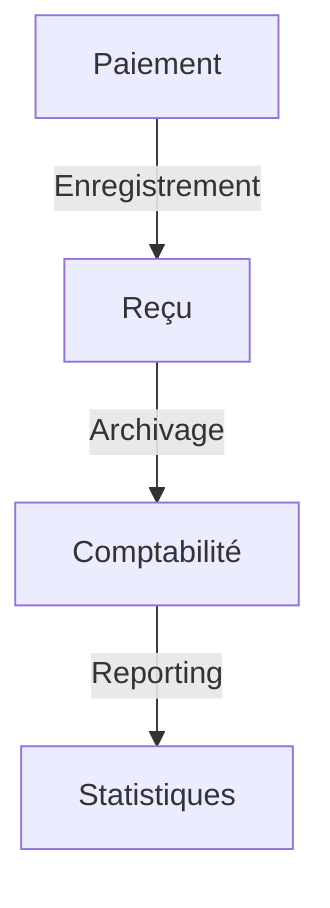

# Logique Métier - Le Circographe

## Vue d'ensemble
L'application gère une association de cirque avec :
- Système de rôles (User, Volunteer, Admin)
- Système d'adhésions (Basic, Cirque)
- Gestion des présences
- Statistiques et rapports

## Composants Principaux

### 1. Rôles et Adhésions
- Rôles système indépendants des adhésions
- Adhésions gérées sur place uniquement
- Validations croisées rôles/adhésions
- Documentation détaillée : [`roles/systeme.md`](../../requirements/1_logique_metier/roles/systeme.md)

### 2. Gestion des Présences
- Pointage par les bénévoles
- Validation adhésions/cotisations
- Statistiques de fréquentation
- Documentation : [`presence/systeme.md`](../../requirements/1_logique_metier/presence/systeme.md)

### 3. Système de Paiement
- Paiement sur place uniquement
- Système de donations
- Traçabilité complète
- Documentation : [`paiements/systeme.md`](../../requirements/1_logique_metier/paiements/systeme.md)

## Processus Clés

### 1. Cycle de Vie Utilisateur

### 2. Flux Financier

## Points d'Attention
- Vérification des droits en temps réel
- Gestion des cas particuliers
- Traçabilité des modifications
- Support multi-rôles 