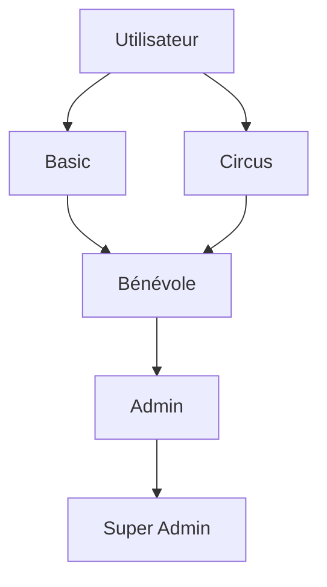
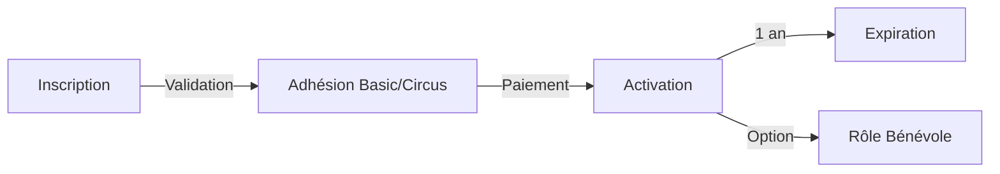
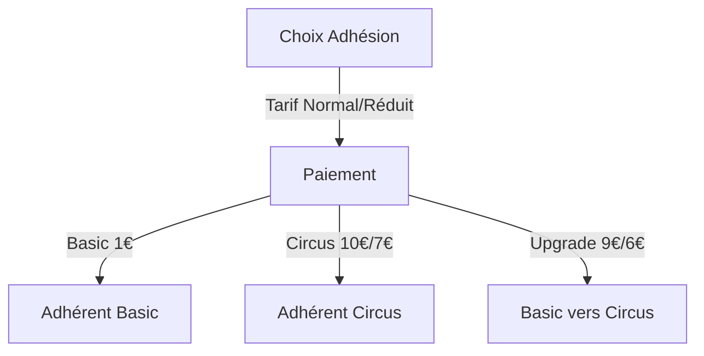

# Types et Conventions

## Adhésions et Rôles

### Adhésions (membership)
```ruby
enum membership: {
  none: 0,    # Pas d'adhésion
  basic: 1,   # Adhérent Basic (1€)
  circus: 2   # Adhérent Cirque (10€/7€)
}
```

### Rôles Administratifs (admin_role)
```ruby
enum admin_role: {
  none: 0,        # Pas de rôle admin
  volunteer: 1,   # Bénévole
  admin: 2,       # Admin
  super_admin: 3  # Super Admin
}
```

### Combinaisons Possibles
Un utilisateur peut avoir une adhésion ET un rôle administratif :
- Adhérent Basic + Bénévole
- Adhérent Cirque + Bénévole
- Adhérent Basic + Admin
- etc.

## Statuts et Tarifs

### Statuts (status)
```ruby
enum status: {
  pending: 0,   # En attente
  active: 1,    # Actif
  expired: 2    # Expiré
}
```

### Types de Tarifs (price_type)
```ruby
enum price_type: {
  normal: 0,    # Tarif normal
  reduced: 1    # Tarif réduit
}
```

## Méthodes Helper

```ruby
class User < ApplicationRecord
  # Vérifie si l'utilisateur a une adhésion
  def member?
    basic? || circus?
  end
  
  # Vérifie si l'utilisateur a un rôle administratif
  def staff?
    volunteer? || admin? || super_admin?
  end
  
  # Vérifie si l'utilisateur peut accéder aux entraînements
  def can_access_training?
    circus? || staff?
  end
  
  # Vérifie si l'utilisateur peut gérer les entraînements
  def can_manage_training?
    staff?
  end
end
```

## Diagrammes

### Hiérarchie des Rôles


### Flux d'Adhésion


### Processus de Paiement


## Conventions de Nommage

### Base de Données
- Tables : pluriel, snake_case (users, memberships)
- Colonnes : singulier, snake_case (user_id, admin_role)
- Enum : singulier (membership, status)

### Code
- Classes : CamelCase (User, Membership)
- Méthodes : snake_case (can_access_training?)
- Variables : snake_case (current_user)

### Interface
- Backend : utiliser les termes techniques (member, admin_role)
- Frontend : utiliser les termes utilisateur (Adhérent, Bénévole)