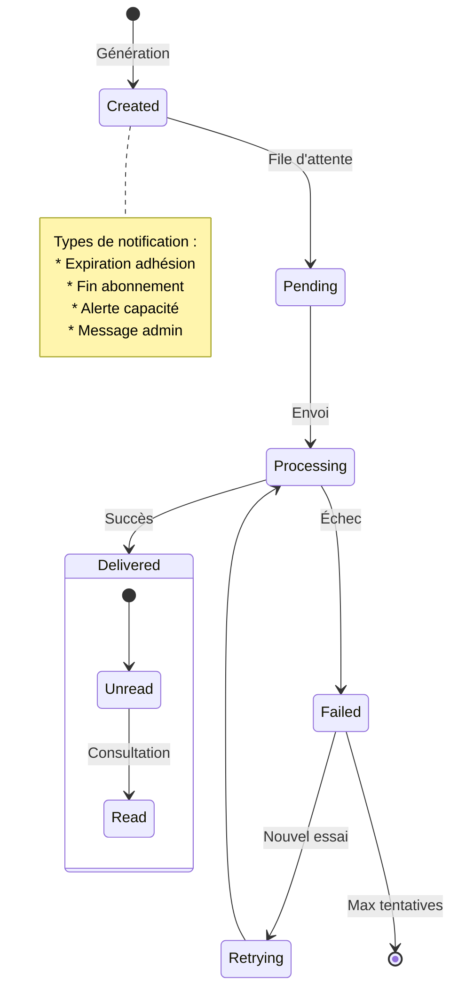

# États des Notifications

```mermaid
stateDiagram-v2
    [*] --> Created: Génération
    Created --> Pending: File d'attente
    Pending --> Processing: Envoi
    Processing --> Delivered: Succès
    Processing --> Failed: Échec
    
    state Delivered {
        [*] --> Unread
        Unread --> Read: Consultation
    }
    
    Failed --> Retrying: Nouvel essai
    Retrying --> Processing
    Failed --> [*]: Max tentatives

    note right of Created
        Types de notification :
        * Expiration adhésion
        * Fin abonnement
        * Alerte capacité
        * Message admin
    end note
``` 