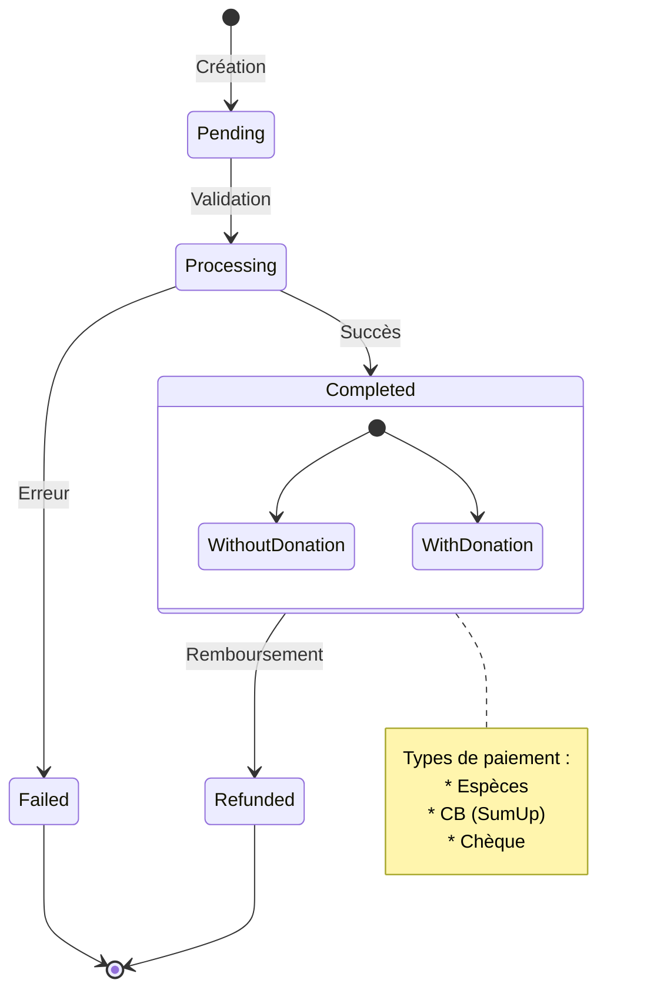

# États des Paiements

```mermaid
stateDiagram-v2
    [*] --> Pending: Création
    Pending --> Processing: Validation
    Processing --> Completed: Succès
    Processing --> Failed: Erreur
    
    state Completed {
        [*] --> WithoutDonation
        [*] --> WithDonation
    }
    
    Completed --> Refunded: Remboursement
    Failed --> [*]
    Refunded --> [*]

    note right of Completed
        Types de paiement :
        * Espèces
        * CB (SumUp)
        * Chèque
    end note
``` 