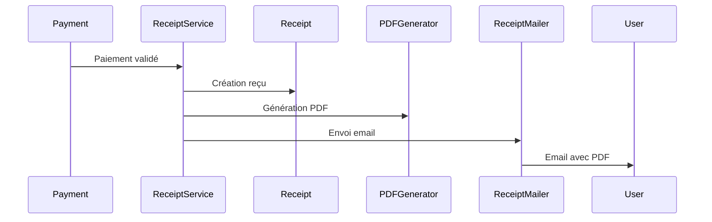

# Documentation Technique - Reçus

## Composants
1. **ReceiptService**
   - Génération des reçus
   - Validation des paiements
   - Gestion des erreurs

2. **ReceiptMailer**
   - Envoi des reçus par email
   - Templates personnalisés
   - Gestion des pièces jointes

3. **PDF Generator**
   - Utilisation de Prawn
   - Templates standardisés
   - Gestion des polices

## Flux de Données

## Points d'Attention
1. **Sécurité**
   - Validation des montants
   - Unicité des numéros
   - Archivage sécurisé

2. **Performance**
   - Génération PDF asynchrone
   - Optimisation taille fichiers
   - Cache des templates 