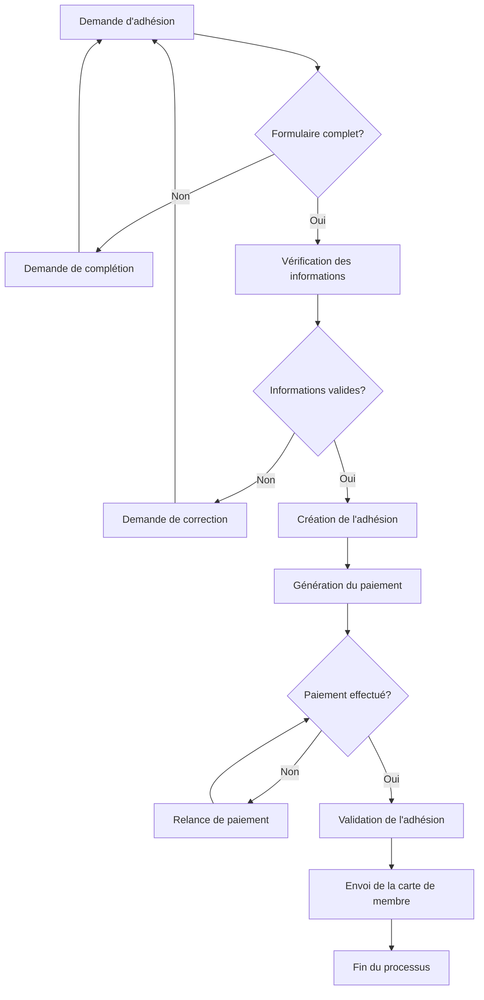
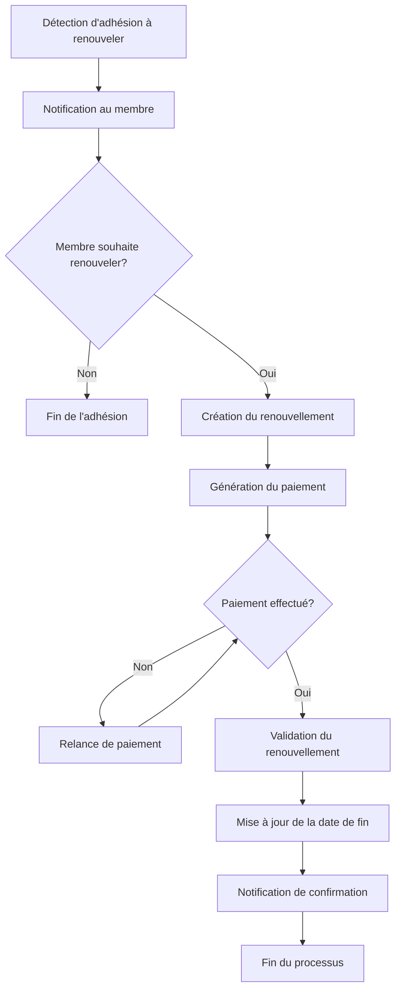
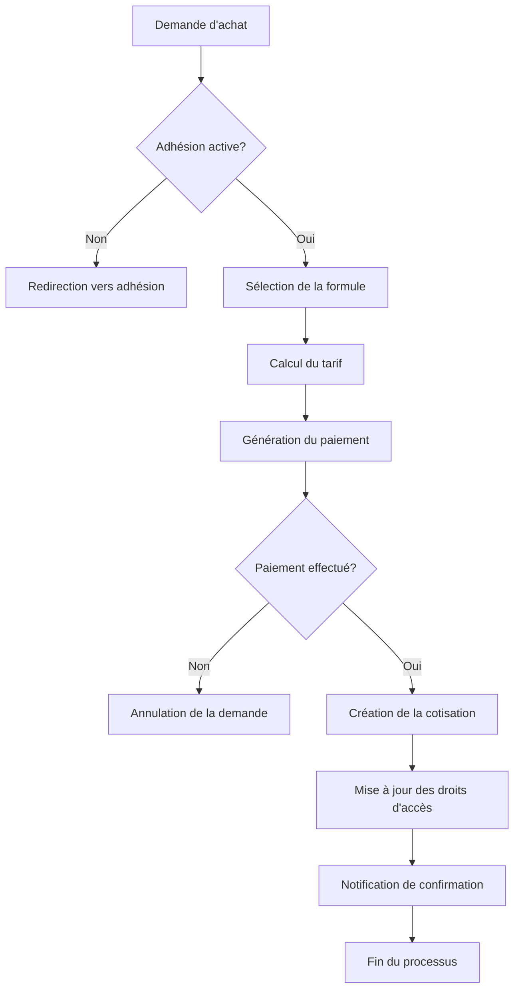
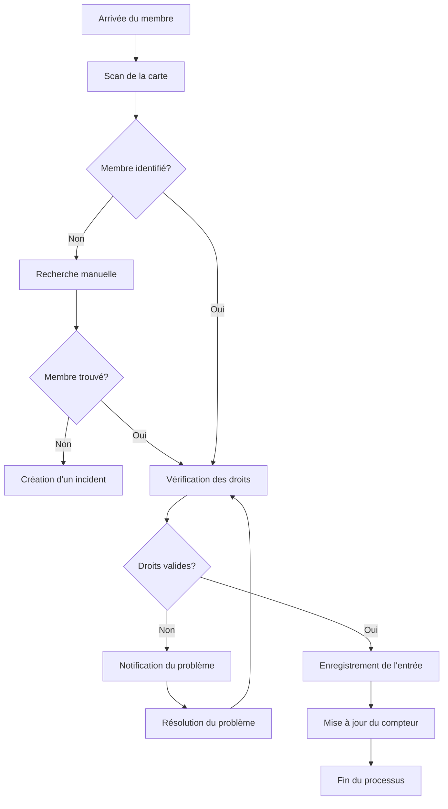
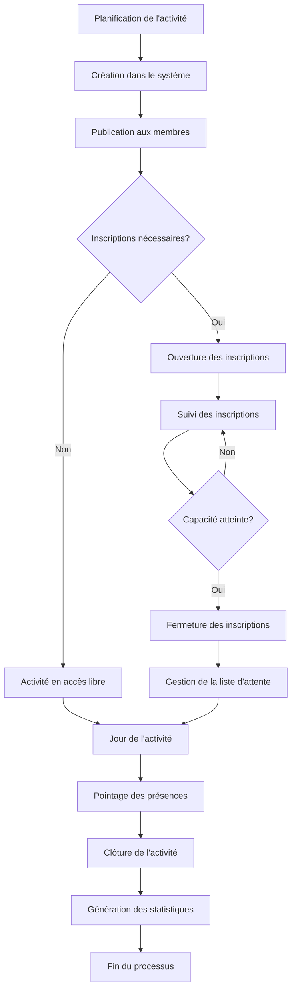
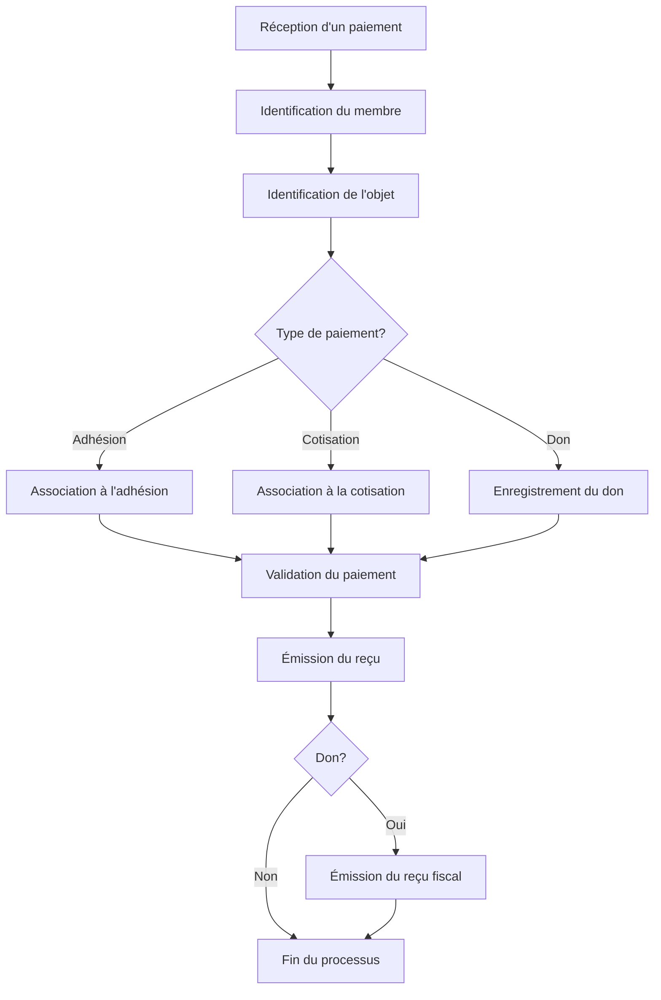
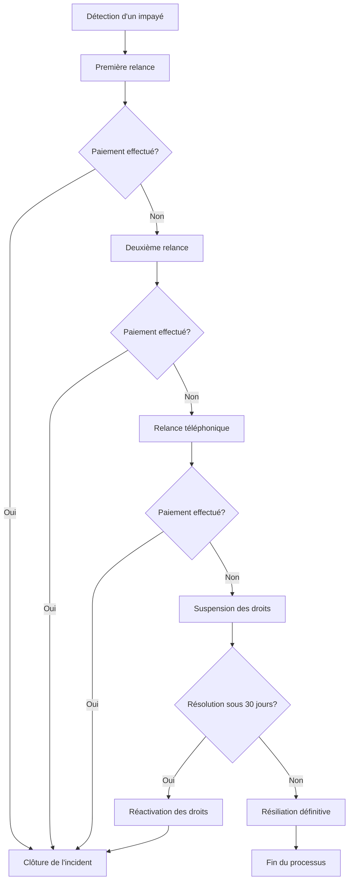
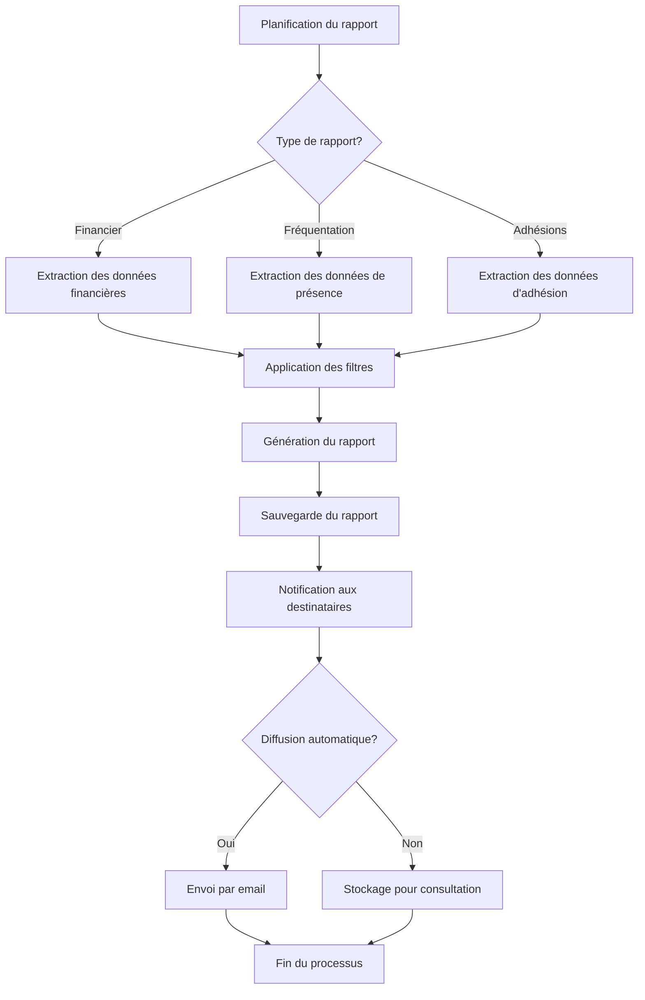

# Workflows Administratifs - Le Circographe

Ce document décrit les workflows administratifs du Circographe, c'est-à-dire les processus métier qui impliquent des actions administratives. Ces workflows sont conçus pour garantir la cohérence des opérations et faciliter la gestion de l'association.

## Gestion des adhésions

### Processus d'adhésion

#### Étapes détaillées

1. **Demande d'adhésion**
   - Le membre remplit le formulaire d'adhésion en ligne
   - Le système vérifie automatiquement la complétude du formulaire

2. **Vérification des informations**
   - L'administrateur vérifie les informations fournies
   - Vérification de l'âge, de l'adresse, etc.

3. **Création de l'adhésion**
   - Création de l'adhésion avec statut "En attente"
   - Attribution d'un numéro de membre

4. **Gestion du paiement**
   - Génération d'une facture pour l'adhésion
   - Suivi du paiement
   - Relances automatiques si nécessaire

5. **Validation de l'adhésion**
   - Changement du statut de l'adhésion à "Active"
   - Mise à jour des droits d'accès du membre

6. **Finalisation**
   - Envoi de la carte de membre (physique ou numérique)
   - Envoi d'un email de bienvenue

### Processus de renouvellement

#### Étapes détaillées

1. **Détection des adhésions à renouveler**
   - Tâche planifiée qui s'exécute quotidiennement
   - Identifie les adhésions qui expirent dans les 30 jours

2. **Notification aux membres**
   - Envoi d'emails automatiques à J-30, J-15 et J-7
   - Notification dans l'application

3. **Création du renouvellement**
   - Le membre confirme son souhait de renouveler
   - Création d'une nouvelle période d'adhésion

4. **Gestion du paiement**
   - Génération d'une facture pour le renouvellement
   - Suivi du paiement
   - Relances automatiques si nécessaire

5. **Validation du renouvellement**
   - Mise à jour de la date de fin de l'adhésion
   - Maintien des droits d'accès du membre

## Gestion des cotisations

### Processus d'achat de cotisation

#### Étapes détaillées

1. **Vérification de l'adhésion**
   - Vérification que le membre a une adhésion active
   - Redirection vers le processus d'adhésion si nécessaire

2. **Sélection de la formule**
   - Le membre choisit la formule souhaitée
   - Le système calcule le tarif applicable (normal ou réduit)

3. **Gestion du paiement**
   - Génération d'une facture pour la cotisation
   - Suivi du paiement
   - Annulation automatique si non-paiement après 24h

4. **Création de la cotisation**
   - Enregistrement de la cotisation avec les dates de validité
   - Mise à jour des droits d'accès du membre

## Gestion des présences

### Processus de pointage

#### Étapes détaillées

1. **Identification du membre**
   - Scan de la carte de membre ou QR code
   - Recherche manuelle si nécessaire

2. **Vérification des droits**
   - Vérification de l'adhésion active
   - Vérification de la cotisation valide pour l'activité
   - Vérification des restrictions éventuelles

3. **Enregistrement de la présence**
   - Horodatage de l'entrée
   - Mise à jour du compteur de présences
   - Notification à l'administrateur si la capacité maximale est atteinte

### Processus de gestion des activités

## Gestion financière

### Processus de suivi des paiements

### Processus de gestion des impayés

## Gestion des rapports

### Processus de génération des rapports

## Ressources supplémentaires

- [Règles métier globales](business_rules.md) - Règles fondamentales régissant l'application
- [Critères de validation](validation_criteria.md) - Critères de validation pour chaque entité
- [Guide de configuration](configuration.md) - Paramètres de configuration de l'application
- [Guide des rapports](reporting.md) - Génération et interprétation des rapports

---

*Dernière mise à jour: Mars 2023*
