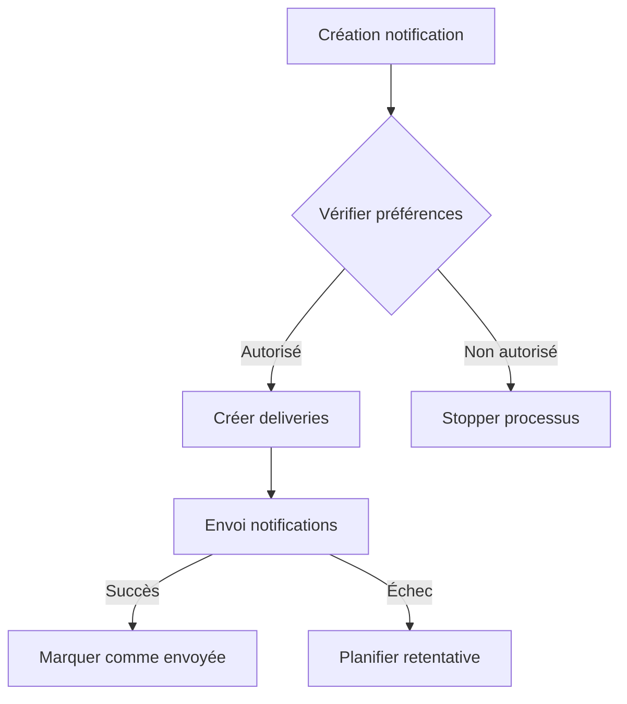
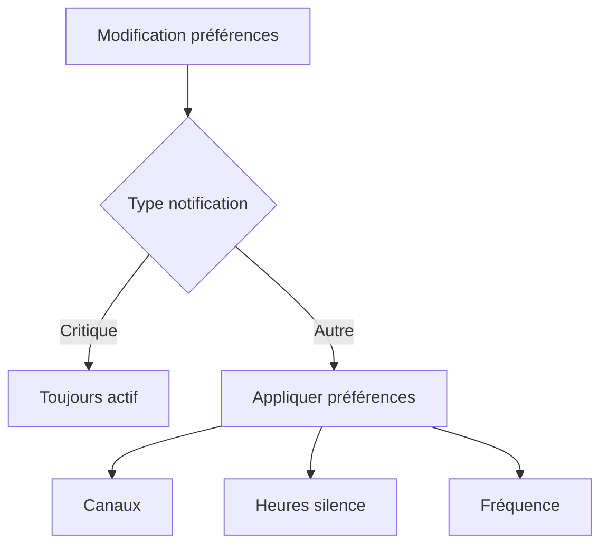

# Domaine Notification

## Vue d'ensemble

Le domaine Notification gère l'ensemble des communications avec les membres de l'association Circographe. Il assure une communication efficace, pertinente et non intrusive tout en respectant les préférences des utilisateurs et les réglementations sur la protection des données.

## Fonctionnalités principales

- Gestion des notifications par type et importance
- Support de multiples canaux de communication (email, push, in-app)
- Gestion des préférences utilisateur
- Suivi du statut des notifications
- Archivage automatique
- Respect des heures de silence

## Types de notifications

### Par importance
- **Critique** : Information essentielle nécessitant une attention immédiate
- **Important** : Information significative sans action immédiate requise
- **Informatif** : Information utile mais non critique
- **Optionnel** : Contenu complémentaire

### Par canal
- **Email** : Communications formelles et détaillées
- **Push** : Alertes immédiates et rappels
- **In-app** : Notifications dans l'application
- **Courrier** : Documents officiels (cas exceptionnels)

### Par source
- **Système** : Notifications automatiques
- **Administratif** : Communications officielles
- **Événementiel** : Activités et événements
- **Communautaire** : Interactions entre membres

## Documentation technique

- [Règles métier](rules.md)
- [Spécifications techniques](specs.md)
- [Critères de validation](validation.md)

## Intégrations

Le domaine Notification interagit avec :

- **Adhésion** : Notifications de renouvellement et expiration
- **Cotisation** : Alertes d'utilisation et expiration
- **Paiement** : Confirmations et rappels
- **Présence** : Confirmations d'entrée et alertes de capacité

## Points d'attention

### 1. Sécurité
- Protection des données personnelles
- Chiffrement des communications
- Gestion des tokens d'authentification
- Traçabilité des envois

### 2. Performance
- Gestion asynchrone des envois
- Regroupement des notifications similaires
- Cache des préférences utilisateur
- Optimisation des requêtes

### 3. Fiabilité
- Gestion des erreurs d'envoi
- Retentatives automatiques
- Fallback entre canaux
- Monitoring des envois

## Modèles de données principaux

- `Notification` : Gestion des notifications
- `NotificationDelivery` : Suivi des envois
- `NotificationPreference` : Préférences utilisateur

## Workflows principaux

### 1. Création et envoi d'une notification


### 2. Gestion des préférences


## Maintenance

- Nettoyage périodique des notifications anciennes
- Vérification des tokens push invalides
- Monitoring des taux de livraison
- Archivage automatique

## Bonnes pratiques

1. **Création de notification**
   - Vérifier la pertinence
   - Respecter les préférences
   - Grouper les notifications similaires
   - Définir la bonne importance

2. **Gestion des envois**
   - Respecter les limites de fréquence
   - Gérer les erreurs proprement
   - Implémenter les retentatives
   - Monitorer les performances

3. **Protection des données**
   - Nettoyer régulièrement
   - Respecter le RGPD
   - Sécuriser les communications
   - Tracer les accès

## Configuration

### Paramètres système
```ruby
notification_settings = {
  delivery: {
    max_retries: 3,
    retry_delay: 10.minutes,
    batch_size: 100
  },
  
  channels: {
    email: {
      enabled: true,
      daily_limit: 10
    },
    push: {
      enabled: true,
      daily_limit: 20
    }
  },
  
  quiet_hours: {
    default_start: "21:00",
    default_end: "08:00"
  }
}
```

## Monitoring

### Métriques clés
- Taux de livraison par canal
- Temps moyen de livraison
- Taux d'ouverture
- Taux d'erreur
- Nombre de retentatives

### Alertes
- Échecs d'envoi répétés
- Taux d'erreur anormal
- Dépassement des quotas
- Problèmes de performance

## Guides d'implémentation

### Ajout d'un nouveau type de notification

1. Définir le type dans l'énumération
2. Créer les templates nécessaires
3. Implémenter la logique métier
4. Ajouter les tests appropriés
5. Mettre à jour la documentation

### Intégration d'un nouveau canal

1. Implémenter l'adaptateur de canal
2. Configurer les paramètres
3. Ajouter les préférences utilisateur
4. Mettre à jour les services d'envoi
5. Ajouter le monitoring

---

*Document mis à jour le Mars 2024 - Version 1.1* 