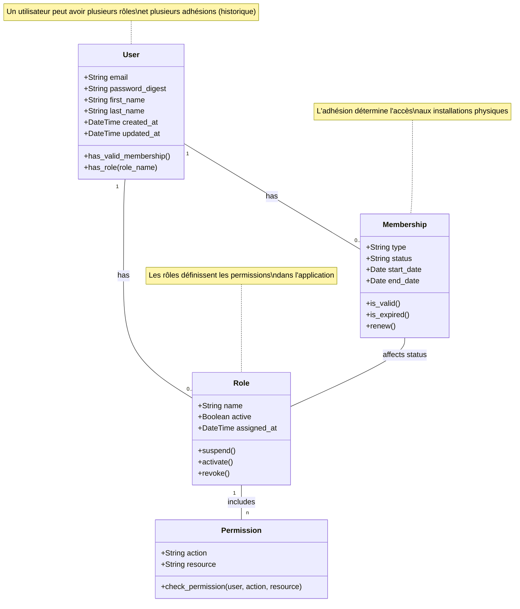

# Règles Métier - Rôles

## Identification du document

| Domaine           | Rôles                               |
|-------------------|-------------------------------------|
| Version           | 1.1                                 |
| Référence         | REGLE-ROL-2024-01                   |
| Dernière révision | Mars 2024                           |

## 1. Définition et objectif

Le domaine des rôles définit le système de permissions et d'accès au sein de l'application Cir cographe. Son objectif est de gérer les niveaux d'accès des utilisateurs aux différentes fonctionnalités de l'application en fonction de leurs responsabilités dans l'association.

> **Important** : Il est essentiel de distinguer le type d'adhésion (qui est géré par le domaine Adhésion et détermine l'accès aux installations) des rôles système (qui définissent les permissions techniques dans l'application).

## 2. Structure des rôles système

Les rôles système représentent les différents niveaux d'accès et de permissions dans l'application Circographe.

| Rôle système     | Description                                              | Conditions d'attribution                                  |
|------------------|----------------------------------------------------------|----------------------------------------------------------|
| Membre           | Niveau de base pour tout adhérent                        | Automatique pour tout utilisateur avec une adhésion valide |
| Bénévole         | Membre autorisé à effectuer des tâches administratives de base | Attribution par un Admin + Adhésion valide         |
| Admin            | Administrateur avec accès étendu aux fonctionnalités     | Attribution par un Super-Admin                            |
| Super-Admin      | Administrateur technique avec tous les droits système    | Configuration initiale ou attribution exceptionnelle      |

## 3. Relation avec le statut d'adhésion

Le statut d'adhésion (géré par le domaine Adhésion) détermine si un utilisateur est membre de l'association et son niveau d'accès aux installations:

| Statut d'adhésion | Accès                                                 | Interaction avec les rôles                               |
|-------------------|-------------------------------------------------------|----------------------------------------------------------|
| Sans adhésion     | Accès limité au site public                           | Aucun rôle système attribué                              |
| Adhésion Basic    | Accès aux événements et aux assemblées générales      | Peut avoir n'importe quel rôle système                   |
| Adhésion Cirque   | Accès aux entraînements (avec cotisation valide)      | Peut avoir n'importe quel rôle système                   |

Si l'adhésion d'un utilisateur expire:
- L'utilisateur conserve ses rôles système, mais ils sont **suspendus**
- Ses rôles sont automatiquement **réactivés** lors du renouvellement de l'adhésion
- L'utilisateur conserve l'accès à ses données personnelles et à son historique même pendant la période de suspension

### Diagramme des relations entre rôles et adhésions

## 4. Matrice des permissions par rôle

### 4.1 Fonctionnalités générales

| Fonctionnalité             | Sans adhésion | Membre | Bénévole | Admin | Super-Admin |
|----------------------------|---------------|--------|----------|-------|-------------|
| Consulter page d'accueil   | ✅           | ✅     | ✅       | ✅    | ✅          |
| Créer un compte            | ✅           | ❌     | ❌       | ❌    | ❌          |
| Se connecter               | ❌           | ✅     | ✅       | ✅    | ✅          |
| Consulter son profil       | ❌           | ✅     | ✅       | ✅    | ✅          |
| Modifier son profil        | ❌           | ✅     | ✅       | ✅    | ✅          |
| Consulter événements       | ✅           | ✅     | ✅       | ✅    | ✅          |
| S'inscrire aux événements  | ❌           | ✅     | ✅       | ✅    | ✅          |

### 4.2 Adhésions et cotisations

| Fonctionnalité               | Sans adhésion | Membre | Bénévole | Admin | Super-Admin |
|------------------------------|---------------|--------|----------|-------|-------------|
| Voir ses adhésions           | ❌           | ✅     | ✅       | ✅    | ✅          |
| Renouveler son adhésion      | ❌           | ✅     | ✅       | ✅    | ✅          |
| Acheter une cotisation       | ❌           | ✅     | ✅       | ✅    | ✅          |
| Voir ses cotisations         | ❌           | ✅     | ✅       | ✅    | ✅          |
| Créer adhésion (pour autrui) | ❌           | ❌     | ✅       | ✅    | ✅          |
| Créer cotisation (pour autrui)| ❌           | ❌     | ✅       | ✅    | ✅          |
| Appliquer tarif réduit       | ❌           | ❌     | ✅       | ✅    | ✅          |

### 4.3 Présences et entraînements

| Fonctionnalité               | Sans adhésion | Membre | Bénévole | Admin | Super-Admin |
|------------------------------|---------------|--------|----------|-------|-------------|
| Consulter planning           | ✅           | ✅     | ✅       | ✅    | ✅          |
| Voir son historique de présence | ❌        | ✅     | ✅       | ✅    | ✅          |
| Accéder aux entraînements    | ❌           | ✅*    | ✅*      | ✅*   | ✅*         |
| Gérer listes de présence     | ❌           | ❌     | ✅       | ✅    | ✅          |
| Créer listes spéciales       | ❌           | ❌     | ❌       | ✅    | ✅          |
| Consulter statistiques       | ❌           | ❌     | ❌       | ✅    | ✅          |

*Nécessite une adhésion Cirque valide ET une cotisation valide

### 4.4 Gestion administrative

| Fonctionnalité               | Sans adhésion | Membre | Bénévole | Admin | Super-Admin |
|------------------------------|---------------|--------|----------|-------|-------------|
| Rechercher membres           | ❌           | ❌     | ✅       | ✅    | ✅          |
| Gestion des paiements        | ❌           | ❌     | ✅       | ✅    | ✅          |
| Gestion des remboursements   | ❌           | ❌     | ❌       | ✅    | ✅          |
| Gestion des utilisateurs     | ❌           | ❌     | ❌       | ✅    | ✅          |
| Attribution rôle Bénévole    | ❌           | ❌     | ❌       | ✅    | ✅          |
| Attribution rôle Admin       | ❌           | ❌     | ❌       | ❌    | ✅          |
| Configuration système        | ❌           | ❌     | ❌       | ❌    | ✅          |

## 5. Règles de gestion des rôles

### 5.1 Attribution et retrait des rôles

| Rôle         | Attribution                                          | Retrait                                              |
|--------------|-----------------------------------------------------|------------------------------------------------------|
| Membre       | Automatique lors de la validation d'une adhésion     | Jamais retiré, seulement suspendu si adhésion expirée |
| Bénévole     | Attribution manuelle par un Admin                    | Décision d'un Admin                                  |
| Admin        | Attribution manuelle par un Super-Admin              | Décision d'un Super-Admin                            |
| Super-Admin  | Configuration initiale ou attribution exceptionnelle | Non applicable sauf cas exceptionnels                |

### 5.2 Relation avec les adhésions

La relation entre les adhésions et les rôles est la suivante:

1. **Adhésion** : Détermine si un utilisateur est membre de l'association et son accès aux installations
2. **Rôle système** : Détermine les permissions techniques dans l'application

L'attribution du rôle "Membre" est automatique pour tout utilisateur avec une adhésion valide:

| Statut d'adhésion       | Effet sur les rôles                   | Processus                                            |
|-------------------------|--------------------------------------|------------------------------------------------------|
| Nouvelle adhésion       | Attribution automatique du rôle Membre | Automatique à la validation du paiement de l'adhésion |
| Adhésion expirée        | Suspension des rôles (pas de retrait) | Automatique à la date d'expiration                   |
| Adhésion renouvelée     | Réactivation des rôles suspendus     | Automatique à la validation du renouvellement        |

### 5.3 Compatibilité des rôles

| Rôle              | Compatibilité avec autres rôles                            |
|-------------------|-----------------------------------------------------------|
| Membre            | Compatible avec tous les autres rôles                      |
| Bénévole          | Compatible avec Membre, Admin et Super-Admin               |
| Admin             | Compatible avec Membre, Bénévole et Super-Admin            |
| Super-Admin       | Compatible avec Membre, Bénévole et Admin                  |

## 6. Processus de gestion des rôles

### 6.1 Attribution du rôle Bénévole

1. L'utilisateur doit avoir une adhésion valide
2. Un Admin ou Super-Admin initie le processus d'attribution
3. Formation de base requise (optionnelle, selon paramètres)
4. Attribution effective du rôle Bénévole
5. Notification à l'utilisateur concerné

### 6.2 Attribution du rôle Admin

1. L'utilisateur doit avoir une adhésion valide
2. Un Super-Admin initie le processus d'attribution
3. Formation complète requise (optionnelle, selon paramètres)
4. Attribution effective du rôle Admin
5. Notification à l'utilisateur concerné

### 6.3 Suspension basée sur l'adhésion

1. Vérification quotidienne des adhésions expirées
2. Pour toute adhésion expirée :
   - Le rôle Membre et tous les autres rôles sont suspendus (mais pas supprimés)
   - L'utilisateur conserve l'accès à ses données personnelles et son historique
   - L'utilisateur ne peut plus accéder aux fonctionnalités nécessitant un rôle actif
3. Notification à l'utilisateur concerné

### 6.4 Réactivation après renouvellement

1. Détection du renouvellement d'adhésion
2. Si une adhésion est renouvelée :
   - Réactivation automatique du rôle Membre
   - Réactivation automatique des autres rôles précédemment suspendus
3. Notification à l'utilisateur concerné

## 7. Implémentation technique

### 7.1 Stockage des rôles

Les rôles sont stockés dans une table dédiée avec les informations suivantes :

| Attribut           | Description                                      |
|--------------------|--------------------------------------------------|
| id                 | Identifiant unique du rôle                       |
| user_id            | Référence à l'utilisateur                        |
| role_type          | Type de rôle (enum: member, volunteer, admin, super_admin) |
| active             | Statut actif/inactif du rôle                     |
| assigned_by_id     | Référence à l'administrateur ayant attribué le rôle |
| assigned_at        | Date d'attribution du rôle                       |
| expires_at         | Date d'expiration du rôle (si applicable)        |
| suspended          | Indicateur de suspension temporaire              |
| suspended_reason   | Raison de la suspension                          |
| created_at         | Date de création                                 |
| updated_at         | Date de dernière modification                    |

### 7.2 Vérification des permissions

La vérification des permissions est effectuée via un service dédié qui :

1. Vérifie les rôles actifs de l'utilisateur
2. Applique la matrice de permissions selon le contexte
3. Pour certaines fonctionnalités, vérifie également le statut d'adhésion
4. Retourne une décision d'autorisation

## 8. Cycle de vie des rôles

| État      | Description                                              | Transition vers                |
|-----------|----------------------------------------------------------|-------------------------------|
| Actif     | Rôle pleinement effectif                                | Suspendu, Inactif             |
| Suspendu  | Rôle temporairement désactivé (ex: adhésion expirée)    | Actif, Inactif                |
| Inactif   | Rôle révoqué ou définitivement supprimé                 | Aucune (état terminal)        | 