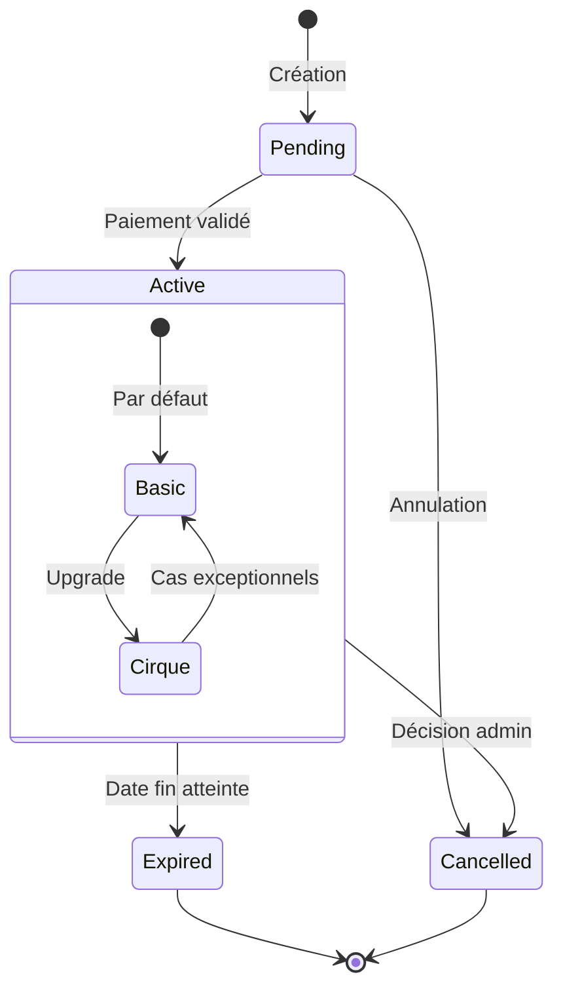

# Domaine: Adhésion

## Vue d'ensemble
Le domaine d'adhésion gère l'ensemble des processus liés aux adhésions des membres à l'association. Il définit les types d'adhésion, les règles de tarification, les états et transitions, ainsi que les processus formels de création, renouvellement et upgrade d'adhésion.

## Documents de référence
- [Règles métier](rules.md) - Définition des règles d'adhésion, types, tarifs et processus
- [Spécifications techniques](specs.md) - Implémentation technique des règles d'adhésion
- [Validation](validation.md) - Critères d'acceptation et tests pour le domaine d'adhésion

## Types d'adhésion
- **Basic** (1€/an) - Adhésion de base donnant accès aux événements
- **Cirque** (10€/an ou 7€/an tarif réduit) - Adhésion complète donnant accès aux entraînements

## Points clés
1. Une adhésion Cirque nécessite une adhésion Basic valide
2. Une seule adhésion active par type est autorisée par personne
3. Les adhésions ont une durée de validité d'un an
4. Le renouvellement est possible 1 mois avant expiration
5. Des tarifs réduits sont disponibles pour certaines catégories (étudiants, RSA, etc.)

## Diagramme d'états



## Processus principaux
1. **Création d'adhésion** - Création d'une nouvelle adhésion pour un membre
2. **Upgrade d'adhésion** - Passage d'une adhésion Basic à une adhésion Cirque
3. **Renouvellement d'adhésion** - Prolongation d'une adhésion existante
4. **Expiration d'adhésion** - Gestion automatique des adhésions expirées

## Implémentation technique
Le domaine d'adhésion est implémenté principalement via:
- Le modèle `Membership` avec ses validations et méthodes
- Le service `MembershipService` pour les opérations complexes
- Le calculateur `MembershipPriceCalculator` pour la tarification

Pour plus de détails sur l'implémentation, consultez les [spécifications techniques](specs.md).

## Modèle de données

### Entité principale: `Membership`

```ruby
class Membership < ApplicationRecord
  belongs_to :user
  has_many :subscriptions, dependent: :restrict_with_error
  has_many :payments, as: :payable, dependent: :restrict_with_error
  has_many :membership_logs, dependent: :destroy
  
  enum status: { pending: 0, active: 1, expired: 2, cancelled: 3 }
  enum membership_type: { standard: 0, family: 1, benefactor: 2 }
  
  validates :start_date, :end_date, presence: true
  validates :membership_number, uniqueness: true, allow_nil: true
  validate :end_date_after_start_date
  validate :membership_number_format, if: -> { membership_number.present? }
  
  before_create :generate_membership_number
  after_save :log_status_change, if: :saved_change_to_status?
  
  scope :active_on, ->(date) { where("start_date <= ? AND end_date >= ?", date, date) }
  scope :expiring_soon, ->(days) { where(status: :active).where("end_date BETWEEN ? AND ?", Date.today, days.days.from_now) }
  
  def active?
    status == "active" && start_date <= Date.today && end_date >= Date.today
  end
  
  def activate!
    update(status: :active) if pending?
  end
  
  def expire!
    update(status: :expired) if active? && end_date < Date.today
  end
  
  def renew!(duration_months = 12)
    new_end_date = [end_date, Date.today].max + duration_months.months
    update(end_date: new_end_date, status: :pending)
  end
  
  private
  
  def end_date_after_start_date
    return if end_date.blank? || start_date.blank?
    errors.add(:end_date, "doit être postérieure à la date de début") if end_date <= start_date
  end
  
  def generate_membership_number
    return if membership_number.present?
    self.membership_number = "MEM-#{Time.now.year}-#{SecureRandom.hex(4).upcase}"
  end
  
  def membership_number_format
    unless membership_number.match?(/\AMEM-\d{4}-[0-9A-F]{8}\z/)
      errors.add(:membership_number, "format invalide (doit être MEM-YYYY-XXXXXXXX)")
    end
  end
  
  def log_status_change
    membership_logs.create(
      action: "status_change",
      previous_value: status_before_last_save,
      new_value: status,
      user_id: Current.user&.id
    )
  end
end
```

### Entités associées

#### `MembershipLog`

```ruby
class MembershipLog < ApplicationRecord
  belongs_to :membership
  belongs_to :user, optional: true
  
  validates :action, :new_value, presence: true
end
```

## API et contrôleurs

### `MembershipsController`

```ruby
class MembershipsController < ApplicationController
  before_action :authenticate_user!
  before_action :set_membership, only: [:show, :edit, :update, :destroy, :activate, :renew]
  before_action :authorize_admin!, only: [:index, :activate]
  
  def index
    @memberships = Membership.includes(:user).order(created_at: :desc)
    @memberships = @memberships.where(status: params[:status]) if params[:status].present?
  end
  
  def show
    authorize @membership
  end
  
  def new
    @membership = current_user.memberships.build
  end
  
  def create
    @membership = current_user.memberships.build(membership_params)
    
    if @membership.save
      redirect_to new_membership_payment_path(@membership), notice: "Demande d'adhésion créée avec succès."
    else
      render :new
    end
  end
  
  def edit
    authorize @membership
  end
  
  def update
    authorize @membership
    
    if @membership.update(membership_params)
      redirect_to @membership, notice: "Adhésion mise à jour avec succès."
    else
      render :edit
    end
  end
  
  def activate
    if @membership.activate!
      MembershipMailer.activation_notification(@membership).deliver_later
      redirect_to @membership, notice: "Adhésion activée avec succès."
    else
      redirect_to @membership, alert: "Impossible d'activer cette adhésion."
    end
  end
  
  def renew
    authorize @membership
    
    if @membership.renew!
      redirect_to new_membership_payment_path(@membership), notice: "Demande de renouvellement créée avec succès."
    else
      redirect_to @membership, alert: "Impossible de renouveler cette adhésion."
    end
  end
  
  private
  
  def set_membership
    @membership = Membership.find(params[:id])
  end
  
  def membership_params
    params.require(:membership).permit(:membership_type, :start_date, :end_date)
  end
  
  def authorize_admin!
    redirect_to root_path, alert: "Accès non autorisé." unless current_user.admin?
  end
end
```

## Services

### `MembershipService`

```ruby
class MembershipService
  def initialize(membership)
    @membership = membership
  end
  
  def process_payment(payment)
    return false unless payment.valid? && payment.amount >= required_amount
    
    ApplicationRecord.transaction do
      payment.save!
      @membership.activate!
      send_activation_notification
      true
    end
  rescue ActiveRecord::RecordInvalid
    false
  end
  
  def check_expiration
    return unless @membership.active? && @membership.end_date < Date.today
    
    @membership.expire!
    send_expiration_notification
  end
  
  def send_renewal_reminders
    return unless @membership.active?
    
    days_until_expiration = (@membership.end_date - Date.today).to_i
    
    case days_until_expiration
    when 30
      MembershipMailer.renewal_reminder(@membership, 30).deliver_later
    when 15
      MembershipMailer.renewal_reminder(@membership, 15).deliver_later
    when 7
      MembershipMailer.renewal_reminder(@membership, 7).deliver_later
    end
  end
  
  private
  
  def required_amount
    case @membership.membership_type
    when "standard"
      25.0
    when "family"
      40.0
    when "benefactor"
      100.0
    else
      25.0
    end
  end
  
  def send_activation_notification
    MembershipMailer.activation_notification(@membership).deliver_later
  end
  
  def send_expiration_notification
    MembershipMailer.expiration_notification(@membership).deliver_later
  end
end
```

## Tâches planifiées

```ruby
# config/initializers/scheduler.rb
require 'rufus-scheduler'

scheduler = Rufus::Scheduler.singleton

# Vérification quotidienne des adhésions expirées
scheduler.cron '0 1 * * *' do
  Membership.where(status: :active).find_each do |membership|
    MembershipService.new(membership).check_expiration
  end
end

# Envoi des rappels de renouvellement
scheduler.cron '0 8 * * *' do
  Membership.where(status: :active).find_each do |membership|
    MembershipService.new(membership).send_renewal_reminders
  end
end
```

## Tests

```ruby
# spec/models/membership_spec.rb
require 'rails_helper'

RSpec.describe Membership, type: :model do
  describe "validations" do
    it "is valid with valid attributes" do
      membership = build(:membership)
      expect(membership).to be_valid
    end
    
    it "is not valid without a start date" do
      membership = build(:membership, start_date: nil)
      expect(membership).not_to be_valid
    end
    
    it "is not valid without an end date" do
      membership = build(:membership, end_date: nil)
      expect(membership).not_to be_valid
    end
    
    it "is not valid if end date is before start date" do
      membership = build(:membership, start_date: Date.today, end_date: Date.yesterday)
      expect(membership).not_to be_valid
    end
  end
  
  describe "#active?" do
    it "returns true for active membership within date range" do
      membership = create(:membership, status: :active, start_date: 1.day.ago, end_date: 1.day.from_now)
      expect(membership.active?).to be true
    end
    
    it "returns false for active membership outside date range" do
      membership = create(:membership, status: :active, start_date: 2.days.from_now, end_date: 3.days.from_now)
      expect(membership.active?).to be false
    end
    
    it "returns false for non-active membership within date range" do
      membership = create(:membership, status: :pending, start_date: 1.day.ago, end_date: 1.day.from_now)
      expect(membership.active?).to be false
    end
  end
  
  # Plus de tests...
end
```

## Règles métier

Pour les règles métier détaillées, consultez [rules.md](rules.md).

## Critères de validation

Pour les critères de validation, consultez [validation.md](validation.md).

## Guides d'implémentation

### Création d'une nouvelle adhésion

1. Créer un nouvel enregistrement `Membership`
2. Définir le statut initial à "pending"
3. Créer un paiement associé
4. Après validation du paiement, activer l'adhésion

### Renouvellement d'adhésion

1. Utiliser la méthode `renew!` sur l'objet `Membership` existant
2. Créer un nouveau paiement pour le renouvellement
3. Après validation du paiement, mettre à jour le statut

### Gestion des expirations

1. Utiliser la tâche planifiée pour vérifier quotidiennement les adhésions
2. Pour les adhésions expirées, appeler la méthode `expire!`
3. Envoyer les notifications appropriées

---

*Dernière mise à jour: Mars 2023* 