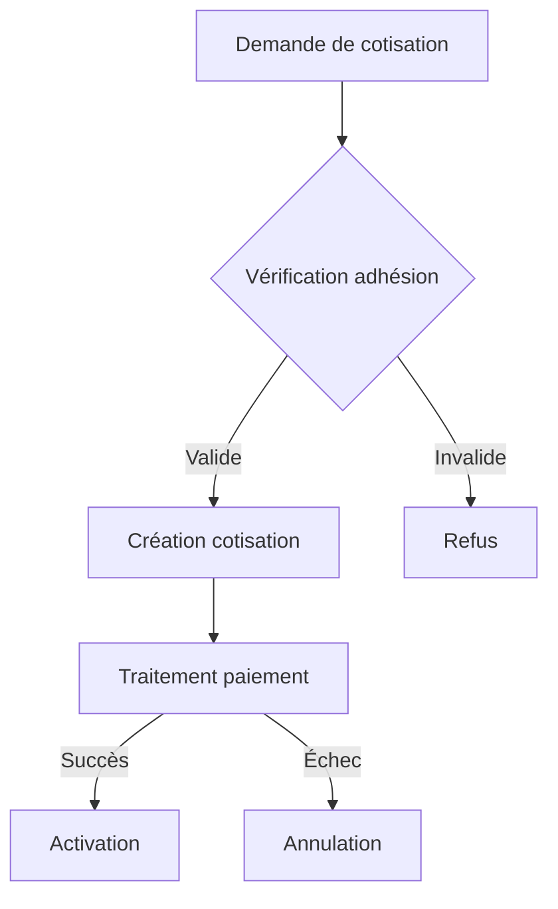
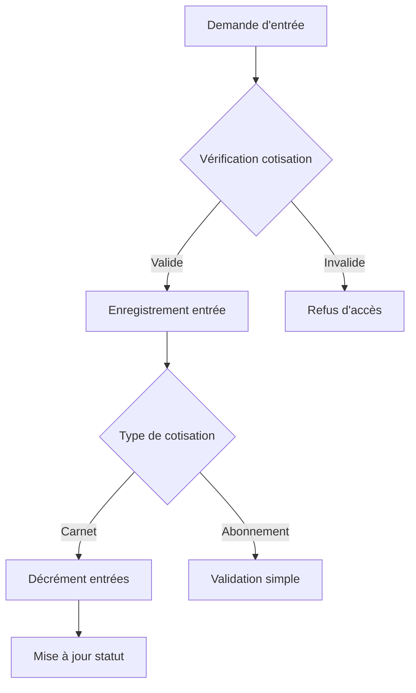
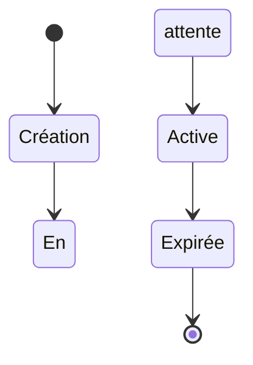

# Domaine Cotisation

## Vue d'ensemble

Le domaine Cotisation gère l'ensemble des contributions financières permettant aux membres de l'association d'accéder aux entraînements et activités du Circographe. Il constitue un élément central du système, assurant la gestion des différents types de cotisations, leur cycle de vie, et leur utilisation.

## Fonctionnalités principales

- Gestion des différents types de cotisations (Pass Journée, Carnet 10 Séances, Abonnements)
- Suivi des entrées et de leur utilisation
- Gestion des paiements et des paiements échelonnés
- Contrôle des accès aux entraînements
- Notifications automatiques (expiration, entrées restantes)
- Génération de rapports statistiques

## Types de cotisations

### Pass Journée
- Prix : 4€
- Validité : Jour d'achat uniquement
- 1 entrée unique
- Pour les pratiquants occasionnels

### Carnet 10 Séances
- Prix : 30€
- Validité : Illimitée
- 10 entrées
- Pour les pratiquants réguliers
- Cumulable avec d'autres carnets

### Abonnement Trimestriel
- Prix : 65€
- Validité : 3 mois
- Entrées illimitées
- Pour les pratiquants assidus
- Paiement échelonné possible

### Abonnement Annuel
- Prix : 150€
- Validité : 12 mois
- Entrées illimitées
- Pour les pratiquants intensifs
- Paiement échelonné possible

## Documentation technique

- [Règles métier](rules.md)
- [Spécifications techniques](specs.md)
- [Critères de validation](validation.md)

## Intégrations

Le domaine Cotisation interagit avec :

- **Adhésion** : Vérification des prérequis d'adhésion
- **Présence** : Gestion des entrées aux entraînements
- **Paiement** : Traitement des paiements et remboursements
- **Notification** : Alertes d'expiration et de renouvellement

## Points d'attention

### 1. Sécurité
- Validation stricte des prérequis d'adhésion
- Contrôle des accès selon les rôles
- Traçabilité des opérations financières
- Protection contre la double utilisation

### 2. Performance
- Cache des vérifications fréquentes
- Optimisation des requêtes de validation
- Indexation appropriée des données

### 3. Fiabilité
- Transactions atomiques pour les opérations critiques
- Validation des états de cotisation
- Gestion robuste des cas limites

## Modèles de données principaux

- `Contribution` : Gestion des cotisations
- `Entry` : Enregistrement des entrées
- `Payment` : Suivi des paiements

## Workflows principaux

### 1. Création d'une cotisation


### 2. Utilisation d'une cotisation


## Maintenance

- Vérification quotidienne des expirations
- Nettoyage des cotisations anciennes
- Monitoring des anomalies d'utilisation
- Sauvegarde des données sensibles

## Bonnes pratiques

1. **Création de cotisation**
   - Vérifier l'adhésion Cirque valide
   - Valider la compatibilité des abonnements
   - Documenter les cas particuliers

2. **Gestion des entrées**
   - Vérifier les conditions d'accès
   - Appliquer l'ordre de priorité correct
   - Tracer toutes les utilisations

3. **Paiements**
   - Valider les montants exacts
   - Sécuriser les paiements échelonnés
   - Documenter les remboursements

## Diagramme d'états



## Processus principaux
1. **Création de cotisation** - Création d'une nouvelle cotisation pour un membre
2. **Enregistrement d'entrée** - Utilisation d'une cotisation pour accéder à un entraînement
3. **Expiration de cotisation** - Gestion automatique des cotisations expirées
4. **Renouvellement de cotisation** - Prolongation d'une cotisation existante

## Implémentation technique
Le domaine de cotisation est implémenté principalement via:
- Le modèle `Contribution` avec ses validations et méthodes
- Le service `ContributionCreationService` pour la création de cotisations
- Le service `EntryRecordService` pour l'enregistrement des entrées

Pour plus de détails sur l'implémentation, consultez les [spécifications techniques](specs.md).

## Modèle de données

### Entité principale: `Contribution`

```ruby
class Contribution < ApplicationRecord
  # Énumérations
  enum contribution_type: {
    pass_day: 0,
    entry_pack: 1,
    subscription_quarterly: 2, 
    subscription_annual: 3
  }
  
  enum status: {
    pending: 0,
    active: 1,
    expired: 2,
    cancelled: 3
  }
  
  # Associations
  belongs_to :user
  has_many :entries, dependent: :nullify
  has_many :payments, dependent: :nullify
  
  # Validations
  validates :contribution_type, presence: true
  validates :status, presence: true
  validates :amount, presence: true
  validates :start_date, presence: true
  
  # Méthodes
  def active?
    status == "active" && 
    start_date <= Date.today && 
    (end_date.nil? || end_date >= Date.today)
  end
  
  def expired?
    status == "expired" || 
    (end_date.present? && end_date < Date.today) ||
    (entry_pack? && entries_left == 0)
  end
  
  def subscription?
    subscription_quarterly? || subscription_annual?
  end
  
  def use_entry!
    return false unless active?
    
    if entry_pack?
      self.entries_left -= 1
      self.status = :expired if entries_left <= 0
      save
    end
    
    true
  end
end
```

### Entités associées

#### `Entry`

```ruby
class Entry < ApplicationRecord
  belongs_to :contribution
  belongs_to :user
  belongs_to :recorded_by, class_name: 'User'
  
  validates :entry_date, presence: true
  
  validate :contribution_active_at_entry_date
  validate :user_matches_contribution_user
  
  private
  
  def contribution_active_at_entry_date
    return unless contribution && entry_date
    
    unless contribution.active? && 
           contribution.start_date <= entry_date.to_date &&
           (contribution.end_date.nil? || contribution.end_date >= entry_date.to_date)
      errors.add(:contribution, "was not active at entry date")
    end
    
    if contribution.entry_pack? && contribution.entries_left <= 0
      errors.add(:contribution, "has no entries left")
    end
  end
  
  def user_matches_contribution_user
    return unless contribution && user
    
    unless user_id == contribution.user_id
      errors.add(:user, "does not match the contribution user")
    end
  end
end
```

#### `Payment`

```ruby
class Payment < ApplicationRecord
  belongs_to :contribution
  belongs_to :recorded_by, class_name: 'User'
  
  enum payment_method: { cash: 0, card: 1, check: 2 }
  enum status: { pending: 0, completed: 1, failed: 2 }
  
  validates :amount, presence: true, numericality: { greater_than: 0 }
  validates :payment_method, presence: true
  validates :payment_date, presence: true
  validates :status, presence: true
  
  after_save :update_contribution_payment_status
  
  private
  
  def update_contribution_payment_status
    total_paid = contribution.payments.where(status: :completed).sum(:amount)
    
    if total_paid >= contribution.amount
      contribution.update(payment_status: :completed, status: :active)
    end
  end
end
```

## Services

### `ContributionCreationService`

```ruby
class ContributionCreationService
  attr_reader :errors
  
  def initialize(user, params)
    @user = user
    @params = params
    @errors = []
  end
  
  def create
    return false unless validate_prerequisites
    
    ActiveRecord::Base.transaction do
      create_contribution
      create_payments if @contribution.persisted?
      activate_if_payment_complete
      
      raise ActiveRecord::Rollback if @errors.any?
    end
    
    @errors.empty?
  end
  
  private
  
  def validate_prerequisites
    unless @user.has_valid_cirque_membership?
      @errors << "User must have a valid Cirque membership"
      return false
    end
    
    if subscription? && has_overlapping_subscription?
      @errors << "User already has an active subscription during this period"
      return false
    end
    
    true
  end
  
  # Autres méthodes privées...
end
```

### `EntryRecordService`

```ruby
class EntryRecordService
  attr_reader :errors, :entry
  
  def initialize(user, admin)
    @user = user
    @admin = admin
    @errors = []
    @entry = nil
  end
  
  def record_entry
    return false unless validate_user
    
    contribution = find_best_contribution
    
    return false unless contribution
    
    ActiveRecord::Base.transaction do
      @entry = Entry.new(
        contribution: contribution,
        user: @user,
        recorded_by: @admin,
        entry_date: DateTime.now,
        cancelled: false
      )
      
      unless @entry.save
        @errors += @entry.errors.full_messages
        raise ActiveRecord::Rollback
      end
      
      if contribution.entry_pack?
        contribution.entries_left -= 1
        
        unless contribution.save
          @errors += contribution.errors.full_messages
          raise ActiveRecord::Rollback
        end
        
        if contribution.entries_left <= 0
          contribution.update(status: :expired)
        end
      end
    end
    
    @errors.empty?
  end
  
  private
  
  def find_best_contribution
    # Logique de priorité:
    # 1. Abonnements actifs
    # 2. Carnets avec entrées
    # 3. Pass journée non utilisé aujourd'hui
    
    # Implémentation...
  end
  
  # Autres méthodes privées...
end
```

## Tâches planifiées

```ruby
# config/initializers/scheduler.rb
require 'rufus-scheduler'

scheduler = Rufus::Scheduler.singleton

# Vérification quotidienne des cotisations expirées
scheduler.cron '0 2 * * *' do
  Contribution.where(status: :active)
              .where("end_date < ?", Date.today)
              .update_all(status: :expired)
end

# Envoi des rappels d'expiration
scheduler.cron '0 9 * * *' do
  # Abonnements expirant dans 30 jours
  expiring_soon = Contribution.where(status: :active)
                             .where(contribution_type: [2, 3]) # Abonnements
                             .where("end_date = ?", 30.days.from_now.to_date)
  
  expiring_soon.find_each do |contribution|
    ContributionMailer.expiration_reminder(contribution, 30).deliver_later
  end
  
  # Carnets avec peu d'entrées
  low_entries = Contribution.where(status: :active)
                           .where(contribution_type: 1) # Carnets
                           .where(entries_left: 1..3)
  
  low_entries.find_each do |contribution|
    ContributionMailer.low_entries_reminder(contribution).deliver_later
  end
end
```

## Règles métier

Pour les règles métier détaillées, consultez [rules.md](rules.md).

## Critères de validation

Pour les critères de validation, consultez [validation.md](validation.md).

## Guides d'implémentation

### Création d'une nouvelle cotisation

1. Vérifier que l'utilisateur a une adhésion Cirque valide
2. Vérifier qu'il n'y a pas d'abonnement actif si on crée un abonnement
3. Créer la cotisation avec le statut "pending"
4. Créer le paiement associé
5. Activer la cotisation après validation du paiement

### Enregistrement d'une entrée

1. Vérifier que l'utilisateur a une adhésion Cirque valide
2. Trouver la meilleure cotisation à utiliser selon l'ordre de priorité
3. Créer l'entrée associée à cette cotisation
4. Si c'est un carnet, décrémenter le nombre d'entrées restantes
5. Si le carnet n'a plus d'entrées, le marquer comme expiré

### Gestion des expirations

1. Vérifier quotidiennement les cotisations dont la date de fin est dépassée
2. Marquer ces cotisations comme expirées
3. Envoyer les notifications appropriées

---

*Dernière mise à jour: Mars 2023* 