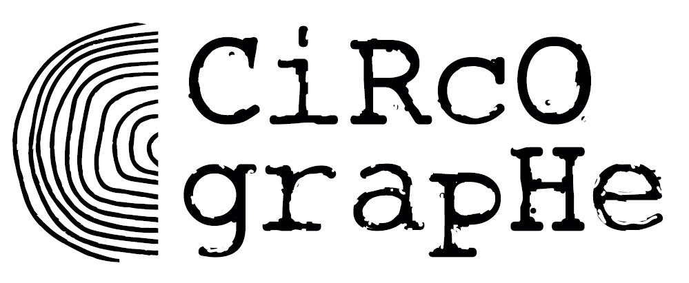

# Le Circographe - Documentation Officielle 📚

  
  
<i>Une application de gestion complète pour association de cirque</i>

  
  
  
  

  <a href="../README.md">⬅️ Retour au projet</a>

## 🎯 Vue d'ensemble
Le Circographe est une application de gestion complète pour une association de cirque, développée avec Ruby on Rails 8.0.1. Cette documentation couvre l'ensemble des aspects techniques, fonctionnels et organisationnels du projet.

## 🧭 Navigation

- [📘 Guide de démarrage rapide](#-guide-de-démarrage-rapide)
- [🏛️ Structure de la documentation](#-structure-de-la-documentation)
- [🔄 Domaines métier](#-domaines-métier)
- [📋 Guides par cas d'usage](#-guides-par-cas-dusage)
- [📝 Contribution](#-contribution)
- [📞 Support](#-support-et-contact)
- [🛠️ Guide de développement](../CONTRIBUTING.md)

## 📘 Guide de démarrage rapide

| Documentation | Description |
|---------------|-------------|
| [🔧 Installation](../documentations/technical/setup.md) | Comment installer l'application |
| [🚀 Premier pas](../documentations/guide/README.md) | Guide de prise en main rapide |
| [❓ FAQ](../documentations/guide/README.md) | Questions fréquemment posées |

## 🏛️ Structure de la documentation

Notre documentation est organisée de manière hiérarchique pour faciliter la navigation:

### 📁 [Documentation Principale](../documentations/README.md)

- [📁 Domaines Métier](../documentations/domains/README.md) - Règles et spécifications métier par domaine
- [📁 Documentation Technique](../documentations/technical/README.md) - Architecture et implémentation
- [📁 Documentation Admin](../documentations/admin/README.md) - Guides pour administrateurs
- [📁 Guides Utilisateur](../documentations/guide/README.md) - Guides pour les utilisateurs finaux

## 🔄 Domaines métier

Notre application est organisée autour de six domaines métier clairement définis, chacun avec ses propres responsabilités:

<table>
  <tr>
    <th>Domaine</th>
    <th>Description</th>
    <th>Documentation</th>
  </tr>
  <tr>
    <td><strong>Adhésion</strong></td>
    <td>
      Gestion des adhésions Basic et Cirque, incluant:
      <ul>
        <li>Création et renouvellement</li>
        <li>Upgrade Basic → Cirque</li>
        <li>Cycle de vie des adhésions</li>
      </ul>
    </td>
    <td>
      <a href="../documentations/domains/adhesion/README.md">Spécifications</a> 
      <a href="../documentations/domains/adhesion/rules.md">Règles métier</a>
    </td>
  </tr>
  <tr>
    <td><strong>Cotisation</strong></td>
    <td>
      Formules d'accès aux entraînements:
      <ul>
        <li>Séances uniques, cartes 10 séances</li>
        <li>Abonnements mensuels et annuels</li>
        <li>Tarifications normale et réduite</li>
      </ul>
    </td>
    <td>
      <a href="../documentations/domains/cotisation/README.md">Spécifications</a> 
      <a href="../documentations/domains/cotisation/rules.md">Règles métier</a>
    </td>
  </tr>
  <tr>
    <td><strong>Paiement</strong></td>
    <td>
      Transactions financières:
      <ul>
        <li>Gestion des paiements et reçus</li>
        <li>Traitement des dons et reçus fiscaux</li>
        <li>Rapports financiers</li>
      </ul>
    </td>
    <td>
      <a href="../documentations/domains/paiement/README.md">Spécifications</a> 
      <a href="../documentations/domains/paiement/rules.md">Règles métier</a>
    </td>
  </tr>
  <tr>
    <td><strong>Présence</strong></td>
    <td>
      Suivi des entraînements:
      <ul>
        <li>Pointage et contrôle d'accès</li>
        <li>Statistiques de fréquentation</li>
        <li>Gestion de la capacité</li>
      </ul>
    </td>
    <td>
      <a href="../documentations/domains/presence/README.md">Spécifications</a> 
      <a href="../documentations/domains/presence/rules.md">Règles métier</a>
    </td>
  </tr>
  <tr>
    <td><strong>Rôles</strong></td>
    <td>
      Gestion des accès:
      <ul>
        <li>Rôles système (permissions)</li>
        <li>Rôles associatifs (fonctions)</li>
        <li>Audit des actions</li>
      </ul>
    </td>
    <td>
      <a href="../documentations/domains/roles/README.md">Spécifications</a> 
      <a href="../documentations/domains/roles/rules.md">Règles métier</a>
    </td>
  </tr>
  <tr>
    <td><strong>Notification</strong></td>
    <td>
      Communication automatisée:
      <ul>
        <li>Rappels et confirmations</li>
        <li>Alertes système</li>
        <li>Préférences de notification</li>
      </ul>
    </td>
    <td>
      <a href="../documentations/domains/notification/README.md">Spécifications</a> 
      <a href="../documentations/domains/notification/rules.md">Règles métier</a>
    </td>
  </tr>
</table>

## 📋 Guides par cas d'usage

Pour faciliter la navigation, nous proposons des guides par cas d'usage qui traversent les différents domaines:

### 👥 Gestion des membres

  
<strong>Voir les guides et références</strong>

  
  - [Guide complet](../documentations/guide/admin/member_management.md)
  - Domaines associés:
    - [Adhésion](../documentations/domains/adhesion/README.md)
    - [Rôles](../documentations/domains/roles/README.md)
    - [Notification](../documentations/domains/notification/README.md)

### 💰 Gestion financière

  
<strong>Voir les guides et références</strong>

  
  - [Guide complet](../documentations/guide/admin/financial_management.md)
  - Domaines associés:
    - [Paiement](../documentations/domains/paiement/README.md)
    - [Adhésion](../documentations/domains/adhesion/README.md)
    - [Cotisation](../documentations/domains/cotisation/README.md)

### 📊 Suivi et statistiques

  
<strong>Voir les guides et références</strong>

  
  - [Guide complet](../documentations/guide/admin/reporting.md)
  - Domaines associés:
    - [Présence](../documentations/domains/presence/README.md)
    - [Paiement](../documentations/domains/paiement/README.md)

## 📝 Contribution

  <h3>🚀 Contribuer au projet</h3>
  
Nous accueillons avec plaisir les contributions de la communauté !

  
  <a href="../CONTRIBUTING.md"><strong>📖 Consulter le guide de contribution complet »</strong></a>

 

  
<strong>Guide de contribution</strong>

  
  Pour contribuer au projet, veuillez consulter notre [guide de contribution détaillé](../CONTRIBUTING.md) qui explique:
  
  1. Le workflow Git à suivre
  2. Les conventions de nommage des branches
  3. Les conventions de commit
  4. Le processus de revue de code
  5. Les standards de test

  
<strong>Standards de documentation</strong>

  
  - Utiliser le Markdown pour tous les documents
  - Suivre les templates fournis
  - Maintenir les liens entre documents
  - Mettre à jour le glossaire si nécessaire

## 🏷️ Versions

- v1.0.0 - Version initiale
- v1.1.0 - Ajout gestion des dons
- v1.2.0 - Intégration comptabilité
- v1.3.0 - Réorganisation de la documentation
- v1.4.0 - Migration vers la nouvelle structure de documentation

## 📞 Support et contact

### Support technique
- **Email** : tech@lecirco.org
- **Discord** : #tech-support

### Support métier
- **Email** : business@lecirco.org
- **Discord** : #business-support

---

  

    <a href="../README.md">⬅️ Retour au projet</a> | 
    <a href="#le-circographe---documentation-officielle-">⬆️ Haut de page</a>
  

  
  
Ce projet est sous licence MIT - voir le fichier <a href="../LICENSE.md">LICENSE.md</a> pour plus de détails.

 
