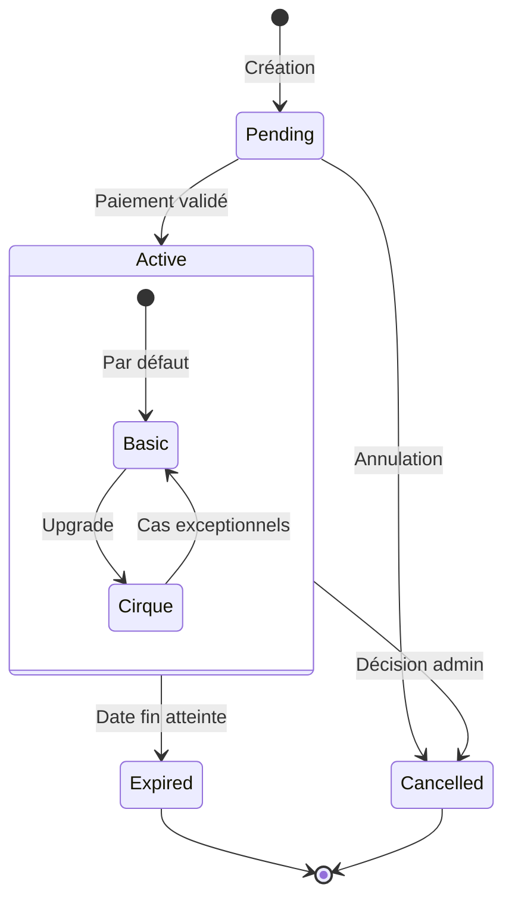

# Règles d'Adhésion - Spécification Définitive

## Identification du Document
- **Domaine**: Adhésion
- **Version**: 1.0.0
- **Statut**: Source de Vérité
- **Dernière révision**: [DATE]

## Types d'Adhésion

### 1. Adhésion Basic
- **Tarif**: 1€/an
- **Validité**: 1 an à partir de la date de souscription
- **Avantages**:
  * Accès aux événements
  * Participation aux assemblées
  * Newsletter
  * Peut être ajouté aux listes de présence
- **Règles spécifiques**:
  * Une seule adhésion Basic active autorisée par personne
  * Souscription uniquement sur place
  * Renouvellement possible 1 mois avant expiration

### 2. Adhésion Cirque
- **Tarifs**:
  * Nouveau membre: 10€/an (normal), 7€/an (réduit)
  * Upgrade depuis Basic: 9€ (normal), 6€ (réduit)
- **Validité**: 1 an à partir de la date de souscription
- **Avantages**:
  * Tous les avantages de l'adhésion Basic
  * Accès aux entraînements (avec cotisation)
  * Historique personnel
- **Règles spécifiques**:
  * Requiert une adhésion Basic valide
  * Une seule adhésion Cirque active autorisée par personne
  * Souscription uniquement sur place
  * Renouvellement possible 1 mois avant expiration

## Conditions Tarif Réduit
1. **Critères d'éligibilité**:
   - Étudiants (carte étudiante)
   - RSA (attestation)
   - Mineurs (-18 ans)
   - Porteurs de handicap
2. **Règles d'application**:
   - Applicable uniquement sur l'adhésion Cirque
   - Justificatif à présenter physiquement
   - Validation visuelle par admin uniquement
   - Pas de stockage du justificatif

## États et Transitions

### États principaux
- **Pending**: Adhésion créée mais en attente de paiement
- **Active**: Adhésion valide et utilisable
- **Expired**: Adhésion expirée (fin de validité)
- **Cancelled**: Adhésion annulée par un administrateur

### Sous-états pour Active
- **Basic**: Adhésion basique (1€)
- **Cirque**: Adhésion complète (10€/7€)

### Transitions autorisées
- Création → Pending
- Pending + Paiement validé → Active
- Active + (date > date expiration) → Expired
- Active + (décision admin) → Cancelled
- Active:Basic + Upgrade → Active:Cirque
- Active:Cirque + (cas exceptionnels) → Active:Basic

### Diagramme d'états

### Processus de renouvellement

## Processus Formels

### 1. Création Adhésion
1. Vérification identité (obligatoire)
2. Choix du type d'adhésion (Basic ou Cirque)
3. Si Cirque, vérification adhésion Basic valide
4. Si tarif réduit, vérification justificatif
5. Paiement et validation
6. Activation immédiate

### 2. Renouvellement Adhésion
1. Vérification statut actuel adhérent
2. Conservation historique
3. Application nouvelles dates de validité
4. Paiement et mise à jour statut

### 3. Upgrade Adhésion
1. Vérification adhésion Basic active
2. Application tarif d'upgrade (9€ ou 6€)
3. Si tarif réduit, vérification justificatif
4. Paiement et mise à jour statut
5. Conservation date d'expiration de l'adhésion Basic

## Méthodes de Paiement Autorisées
| Méthode | Disponible | Reçu | Don Possible |
|---------|------------|------|--------------|
| Espèces | ✅ | Immédiat | ✅ |
| CB (SumUp) | ✅ | Immédiat | ✅ |
| Chèque | ✅ | Immédiat | ✅ |

## Exemples de Calcul (Référence)

### 1. Nouvel Adhérent Basic
- Adhésion Basic: 1€
- **Total: 1€**

### 2. Nouvel Adhérent Cirque
- Adhésion Basic: 1€
- Adhésion Cirque: 9€
- **Total: 10€**

### 3. Nouvel Adhérent Cirque (Tarif Réduit)
- Adhésion Basic: 1€
- Adhésion Cirque Réduit: 6€
- **Total: 7€**

### 4. Upgrade Basic vers Cirque
- Upgrade vers Cirque: 9€
- **Total: 9€**

### 5. Upgrade Basic vers Cirque (Tarif Réduit)
- Upgrade vers Cirque Réduit: 6€
- **Total: 6€**

## Validation et Application

### Règles de Validation
1. Une adhésion Cirque ne peut être créée que si une adhésion Basic valide existe
2. Une seule adhésion active par type est autorisée par personne
3. Les tarifs réduits ne s'appliquent qu'avec justificatif vérifié
4. Toute adhésion a une durée de validité d'un an à date
5. L'activation de l'adhésion est immédiate après paiement validé

### Implémentation Technique (Référence)
| Règle | Implémentation | Statut |
|-------|----------------|--------|
| Types d'adhésion (Basic/Cirque) | User#membership_type enum | ✅ |
| Validation adhésion Basic avant Cirque | Membership#validate_basic_requirement | ✅ |
| Tarifs réduits avec justificatif | Membership#apply_discount | ❌ |
| Durée de validité 1 an | Membership#set_expiration_date | ✅ |
| Renouvellement anticipé | Membership#can_renew? | ✅ | 