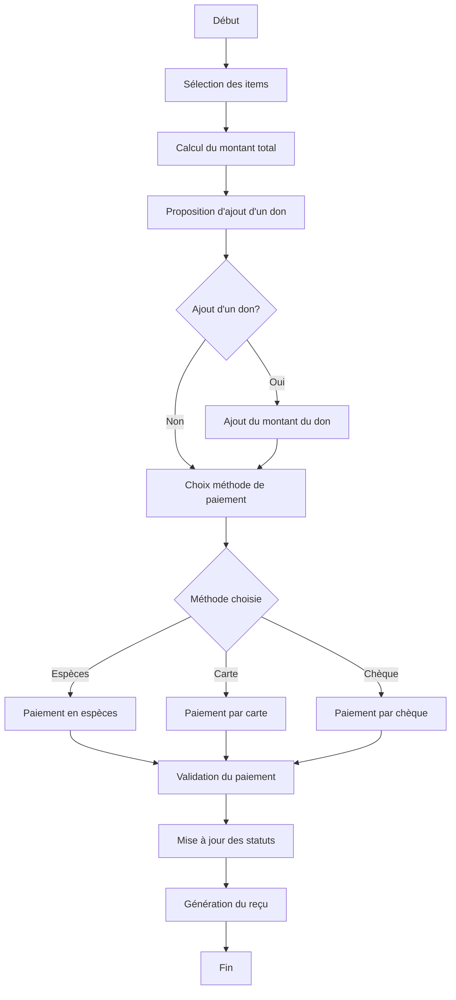

# Règles Métier - Paiements

## Identification du document

| Domaine           | Paiement                            |
|-------------------|-------------------------------------|
| Version           | 1.0                                 |
| Référence         | REGLE-PAI-2023-01                   |
| Dernière révision | [DATE]                              |

## 1. Définition et objectif

Le domaine de paiement définit les processus, méthodes et règles pour toutes les transactions financières au sein du Circographe. Il couvre les paiements d'adhésions, de cotisations, les dons et la gestion des reçus. Ce domaine assure l'intégrité financière de l'association et la traçabilité des transactions.

## 2. Types de paiements

### 2.1 Paiement d'adhésion

| Type                     | Montant standard | Montant réduit |
|--------------------------|------------------|----------------|
| Adhésion Basic           | 1€               | -              |
| Adhésion Cirque          | 10€              | 7€             |
| Upgrade Basic → Cirque   | 9€               | 6€             |

**Règles spécifiques**:
- Le tarif réduit ne s'applique qu'à l'adhésion Cirque, sur présentation d'un justificatif
- Une seule adhésion active par type est autorisée par personne
- L'activation est immédiate après paiement validé

### 2.2 Paiement de cotisation

| Type                   | Montant |
|------------------------|---------|
| Pass Journée           | 4€      |
| Carnet 10 Séances      | 30€     |
| Abonnement Trimestriel | 65€     |
| Abonnement Annuel      | 150€    |

**Règles spécifiques**:
- L'achat de cotisation nécessite une adhésion Cirque valide
- Un seul abonnement actif à la fois (trimestriel ou annuel)
- L'activation est immédiate après paiement validé
- Paiement en plusieurs fois possible pour les montants > 50€

### 2.3 Dons

| Type           | Caractéristiques                          |
|----------------|-------------------------------------------|
| Don simple     | Indépendant des adhésions/cotisations     |
| Don couplé     | Ajouté lors d'un paiement                 |

**Règles spécifiques**:
- Montant libre défini par le donateur
- Option d'anonymat disponible
- Génération d'un reçu fiscal automatique (ou sur demande)
- Traçabilité séparée pour les dons couplés à un paiement

## 3. Méthodes de paiement

### 3.1 Méthodes acceptées

| Méthode         | Disponibilité | Reçu         | Don possible |
|-----------------|---------------|--------------|--------------|
| Espèces         | Sur place     | Immédiat     | Oui          |
| Carte bancaire  | Sur place     | Immédiat     | Oui          |
| Chèque          | Sur place     | Immédiat     | Oui          |

### 3.2 Règles par méthode

#### Espèces
- Montant exact recommandé
- Enregistrement manuel dans le système
- Reçu électronique ou papier selon préférence
- Gestion de la caisse par les administrateurs

#### Carte bancaire (SumUp)
- Terminal de paiement mobile uniquement
- Traitement immédiat
- Reçu électronique via SumUp ou système interne
- Enregistrement automatique dans le système

#### Chèque
- À l'ordre de "Le Circographe"
- Enregistrement manuel dans le système
- Archivage des bordereaux
- Date d'encaissement indiquée au dos pour les paiements échelonnés

## 4. Cycle de vie d'un paiement

### 4.1 États possibles

| État              | Description                                  |
|-------------------|----------------------------------------------|
| Pending           | Paiement créé mais non finalisé              |
| Processing        | Paiement en cours de traitement              |
| Completed         | Paiement validé et complet                   |
| Failed            | Paiement échoué                              |
| Refunded          | Paiement remboursé (cas exceptionnels)       |

#### Sous-états pour Completed
- **WithoutDonation**: Paiement standard sans don
- **WithDonation**: Paiement incluant un don

### 4.2 Transitions d'état

- **Création** → **Pending**: À la création d'un paiement
- **Pending** → **Processing**: Lors du traitement du paiement
- **Processing** → **Completed**: Après validation du paiement
- **Processing** → **Failed**: En cas d'échec du paiement
- **Completed** → **Refunded**: En cas de remboursement (nécessite validation administrative)

## 5. Processus de paiement

### 5.1 Paiement standard

1. Sélection des items à payer (adhésion, cotisation, ou don)
2. Calcul du montant total
3. Proposition d'ajout d'un don (montant libre)
4. Choix de la méthode de paiement
5. Traitement du paiement
6. Validation du paiement et mise à jour des statuts
7. Génération du reçu (électronique ou papier)

#### Diagramme de flux du paiement standard

### 5.2 Paiement en plusieurs fois

*Applicable uniquement pour les montants supérieurs à 50€ (abonnements trimestriels et annuels)*

1. Définition du nombre de mensualités (2 ou 3 maximum)
2. Calcul des montants par échéance
3. Définition des dates d'échéance (généralement 30/60/90 jours)
4. Premier paiement immédiat obligatoire
5. Recueil de tous les chèques avec dates d'encaissement notées
6. Enregistrement des échéances dans le système
7. Génération d'un échéancier pour le membre
8. Suivi automatique des encaissements prévus

## 6. Gestion des reçus

### 6.1 Types de reçus

| Type               | Caractéristiques                               |
|--------------------|-------------------------------------------------|
| Reçu standard      | Pour les paiements d'adhésion et de cotisation  |
| Reçu fiscal        | Pour les dons                                   |
| Échéancier         | Pour les paiements en plusieurs fois            |

### 6.2 Format et contenu

Tous les reçus incluent:
- Logo de l'association
- Numéro unique du reçu (format: YYYYMMDD-TYPE-XXXX)
- Date et heure de la transaction
- Informations du membre
- Type de paiement et montant(s) détaillé(s)
- Méthode de paiement utilisée
- Mention don si applicable
- Mention reçu fiscal si applicable
- Signature électronique du bénévole/admin
- QR code pour version numérique (optionnel)

### 6.3 Distribution

- Envoi par email par défaut (format PDF)
- Disponibilité dans l'espace membre
- Impression possible sur place sur demande
- Archivage numérique pour une durée de 10 ans

## 7. Remboursements

### 7.1 Conditions de remboursement

Les remboursements ne sont possibles que dans des cas exceptionnels:
- Erreur de facturation
- Annulation d'une adhésion ou cotisation (décision administrative)
- Cas de force majeure documenté

### 7.2 Processus de remboursement

1. Demande de remboursement (membre ou administration)
2. Validation par un administrateur autorisé
3. Calcul du montant à rembourser:
   - Pour les adhésions: remboursement total possible si annulation immédiate
   - Pour les cotisations: prorata selon utilisation
   - Pour les dons: non remboursables une fois le reçu fiscal émis
4. Choix du mode de remboursement (prioritairement identique au mode de paiement initial)
5. Exécution du remboursement
6. Génération d'un reçu d'annulation/remboursement
7. Mise à jour des statuts dans le système

## 8. Gestion des dons et reçus fiscaux

### 8.1 Traitement des dons

1. Enregistrement séparé des dons, même lorsqu'ils sont couplés à un autre paiement
2. Conservation des informations du donateur (sauf si anonyme)
3. Catégorisation du don selon sa nature et son affectation

### 8.2 Reçus fiscaux

1. Génération automatique pour chaque don enregistré
2. Génération annuelle d'un reçu fiscal récapitulatif (format CERFA) en janvier
3. Envoi électronique au donateur (ou postale sur demande)
4. Archivage électronique conforme aux obligations légales

## 9. Suivi comptable

### 9.1 Rapprochement bancaire

- Rapprochement quotidien obligatoire
- Vérification des paiements par carte (SumUp)
- Suivi des encaissements de chèques planifiés
- Gestion de la caisse (espèces)

### 9.2 Catégorisation et reporting

- Catégorisation des paiements par type (adhésion, cotisation, don)
- Génération de rapports quotidiens et mensuels
- Exports comptables périodiques
- Statistiques par méthode et type de paiement

## 10. Tableaux récapitulatifs

### 10.1 Méthodes de paiement par type de transaction

| Type de transaction | Espèces | CB | Chèque | Paiement échelonné |
|---------------------|---------|----|---------|--------------------|
| Adhésion Basic      | ✅      | ✅  | ✅      | ❌                 |
| Adhésion Cirque     | ✅      | ✅  | ✅      | ❌                 |
| Pass Journée        | ✅      | ✅  | ✅      | ❌                 |
| Carnet 10 Séances   | ✅      | ✅  | ✅      | ❌                 |
| Abonnement Trimestriel | ✅  | ✅  | ✅      | ✅                 |
| Abonnement Annuel   | ✅      | ✅  | ✅      | ✅                 |
| Don                 | ✅      | ✅  | ✅      | ❌                 |

### 10.2 Récapitulatif des reçus

| Type de transaction | Reçu standard | Reçu fiscal | Échéancier |
|---------------------|---------------|-------------|------------|
| Adhésion            | ✅            | ❌          | ❌         |
| Cotisation          | ✅            | ❌          | ✅ (si échelonné) |
| Don                 | ✅            | ✅          | ❌         |

---

*Document créé le [DATE] - Version 1.0* 