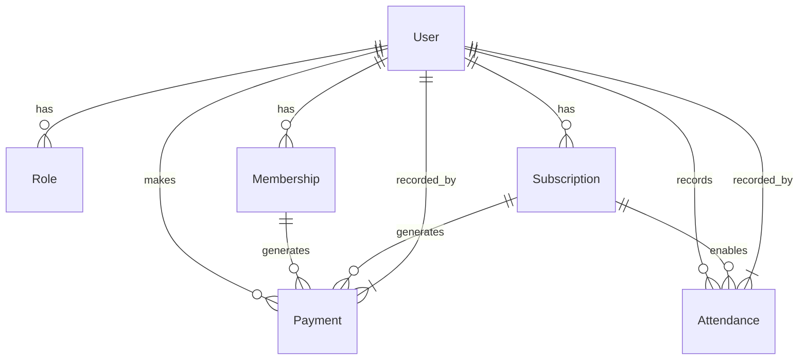

# Relations entre Modèles

## Diagramme des Relations

## Relations Clés

### User → Roles
- Relation many-to-many via roles
- Un utilisateur peut avoir plusieurs rôles
- Les rôles sont cumulatifs
- Historique des attributions conservé

### User → Memberships
- Relation one-to-many
- Types distincts possibles simultanément
- Historique conservé
- Dates de validité gérées

### User → Subscriptions
- Relation one-to-many
- Un seul abonnement actif à la fois
- Historique conservé
- Lié aux présences

### Payments → Payable
- Relation polymorphique
- Peut être lié à une adhésion ou un abonnement
- Traçabilité complète
- Don optionnel inclus

### Attendance → Subscription
- Relation many-to-one
- Optional pour les visiteurs
- Décompte automatique pour les carnets
- Validation des droits d'accès 