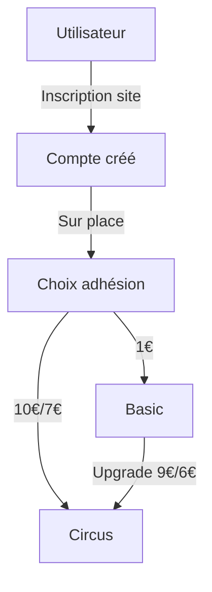
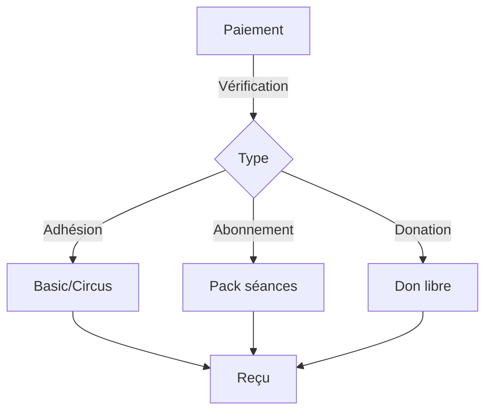
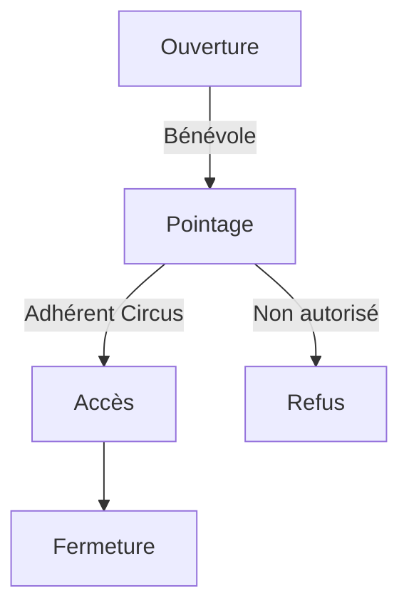

# Workflows Métier

## Processus d'Adhésion

## Processus de Paiement

## Processus d'Entraînement

## Règles de Transition
1. Utilisateur → Adhérent
   - Inscription validée
   - Paiement effectué
   - Sur place uniquement

2. Basic → Circus
   - Adhésion Basic active
   - Paiement upgrade
   - Sur place uniquement

3. Adhérent → Bénévole
   - Adhésion active requise
   - Validation admin 